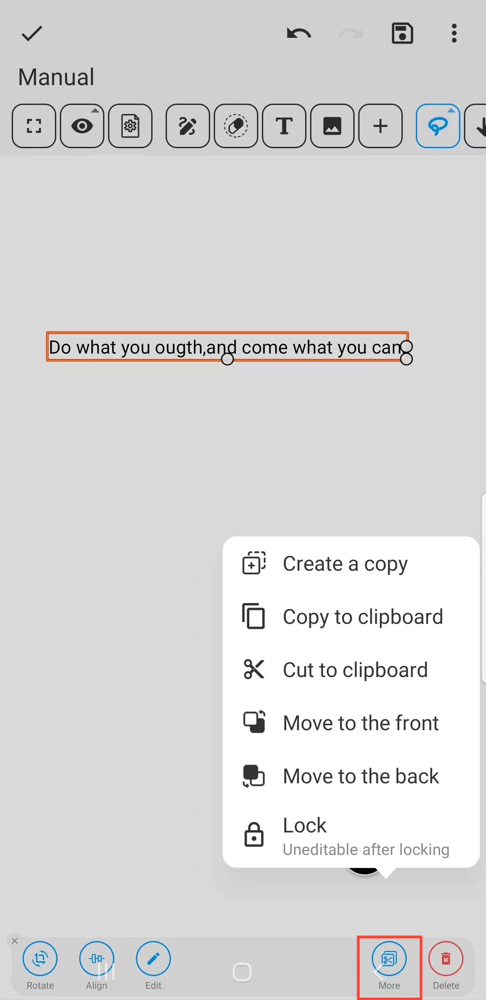

[Manual do Usuário](/dragonnest/drawnote/manual/pt) > [Super Nota](/dragonnest/drawnote/manual/pt/super_note) >

Inserir Texto
---
#### Passos

1. Clique no botão "T" na barra de ferramentas.

2. Toque ou deslize uma área da tela para inserir texto.

#### Dicas
- Uma vez selecionada a caixa de texto, você pode Rotacionar, Alinhar, Editar e mais. Clicando em "Mais", você também pode criar uma cópia, cortar para a área de transferência e bloquear e mais.

  

- Na caixa de edição de texto, uma vez selecionado o texto, você pode definir seu formato, incluindo cor, tamanho, negrito, sublinhado e mais.

