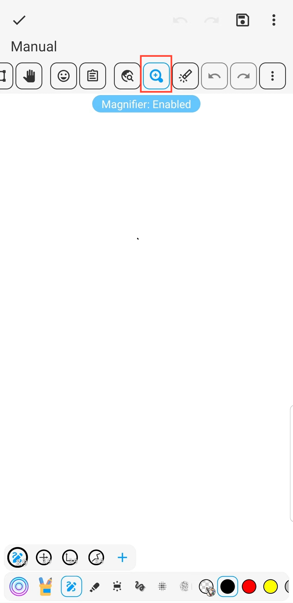

[Manual do Usuário](/dragonnest/drawnote/manual/pt) > [Super Nota](/dragonnest/drawnote/manual/pt/super_note) >

Lupa
---
A função de lupa pode ajudá-lo a visualizar e editar o conteúdo das notas de forma mais conveniente. Especialmente ao trabalhar com fontes pequenas ou gráficos detalhados. Ela pode ampliar texto e imagens e fornecer posicionamento preciso e operação conveniente.
#### Passos

Na página Super Notas, clique no botão da lupa na barra de ferramentas.

