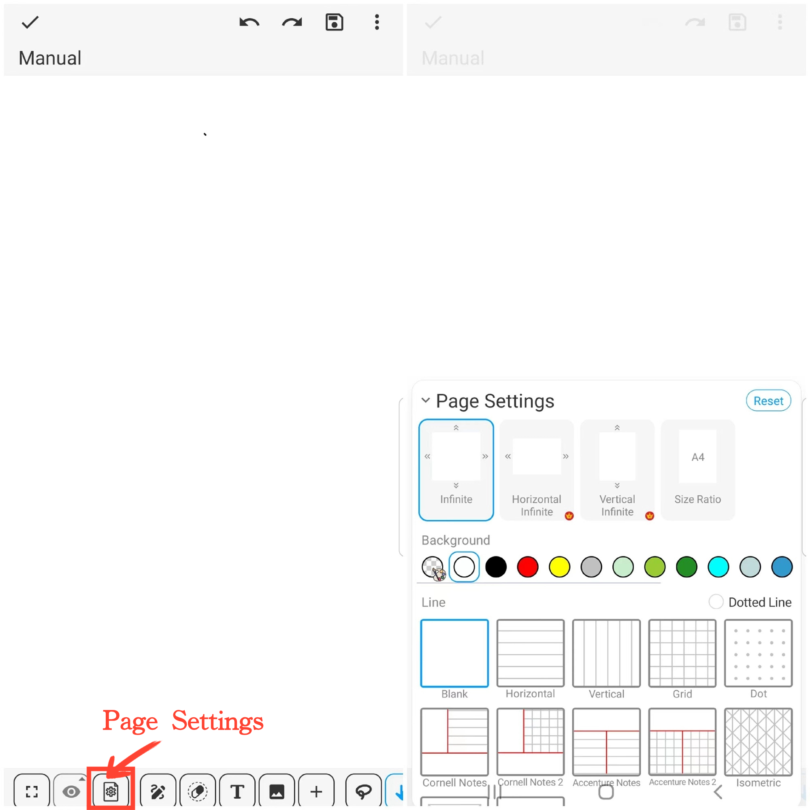

[Manual do Usuário](/dragonnest/drawnote/manual/pt) > [Super Nota](/dragonnest/drawnote/manual/pt/super_note) >

Configurações da Página
---
Você pode configurar a orientação, tamanho, cor de fundo e linhas do canvas.

#### Passos

Clique no botão "Configurações da Página" na barra de ferramentas.

#### Canvas Infinito

Oferecemos três orientações de canvas infinito para atender às suas necessidades e preferências específicas:

- Infinito - Expande infinitamente em ambas as direções horizontal e vertical, com uma faixa de zoom de 0,02x a 200x.
- Horizontal Infinito - Expande infinitamente na direção horizontal com uma faixa de zoom de 0,2x a 1x.
- Vertical Infinito - Expande infinitamente na direção vertical com uma faixa de zoom de 0,2x a 1x.

#### Tamanho do Canvas

Clique em "Proporção do Tamanho" para escolher tamanhos como A4, A3, ou personalize as dimensões conforme sua necessidade.

#### Fundo do Canvas e Linhas de Anotação

Ajuste a cor de fundo, selecione o estilo de linha que atenda às suas necessidades e disponha de uma variedade de modelos de notas para ajudá-lo a organizar e documentar melhor seu conteúdo.