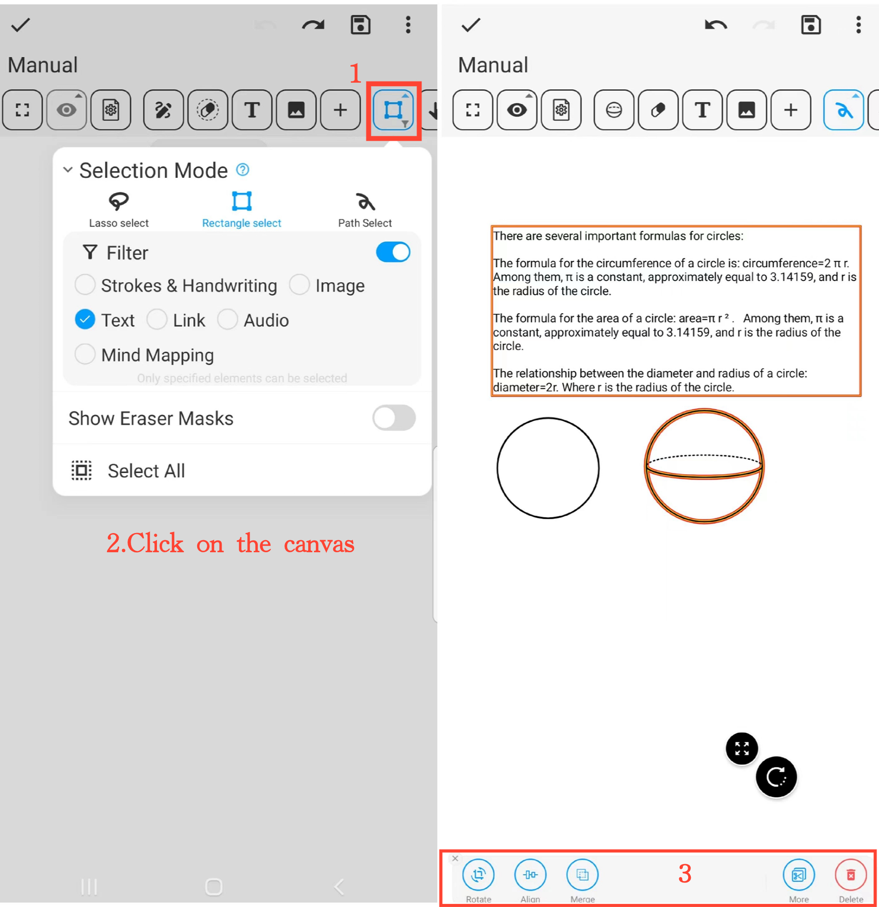

[Manual do Usuário](/dragonnest/drawnote/manual/pt) > [Super Nota](/dragonnest/drawnote/manual/pt/super_note) >

Modo de Seleção
---

O modo de seleção fornece várias ferramentas de seleção:

- Seleção com laço - Seleciona elementos dentro da área fechada formada pelo laço.
- Seleção retangular - Seleciona elementos dentro da área retangular.
- Seleção de Caminho - Seleciona elementos cobertos pelo caminho.

#### Passos

1. Clique no botão "Modo de Seleção" na barra de ferramentas e escolha a ferramenta de seleção desejada.

2. Clique no canvas e deslize para selecionar o conteúdo que deseja editar. Isso pode ser um único elemento ou múltiplos elementos.

3. Execute ações nos itens selecionados, como girar, ampliar, reduzir, mesclar, cortar, excluir e mais.

#### Dica
Quando vários elementos se sobrepõem, você pode ativar o filtro para selecionar precisamente o conteúdo específico, aumentando a eficiência de gerenciamento e organização.