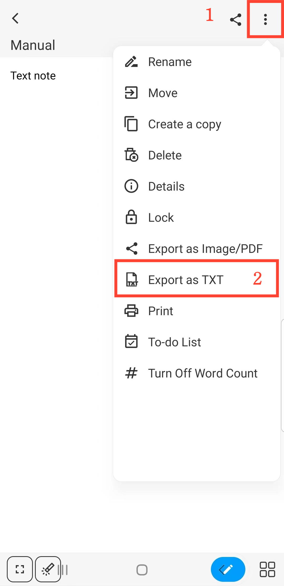

[Manual do Usuário](/dragonnest/drawnote/manual/pt) > [Nota de Texto](/dragonnest/drawnote/manual/pt/text_note) >

Exportar como TXT
---
#### Passos

Enquanto estiver no modo de leitura da Nota de Texto, toque no botão "⋮" localizado no canto superior direito da tela e selecione "Exportar como TXT".

