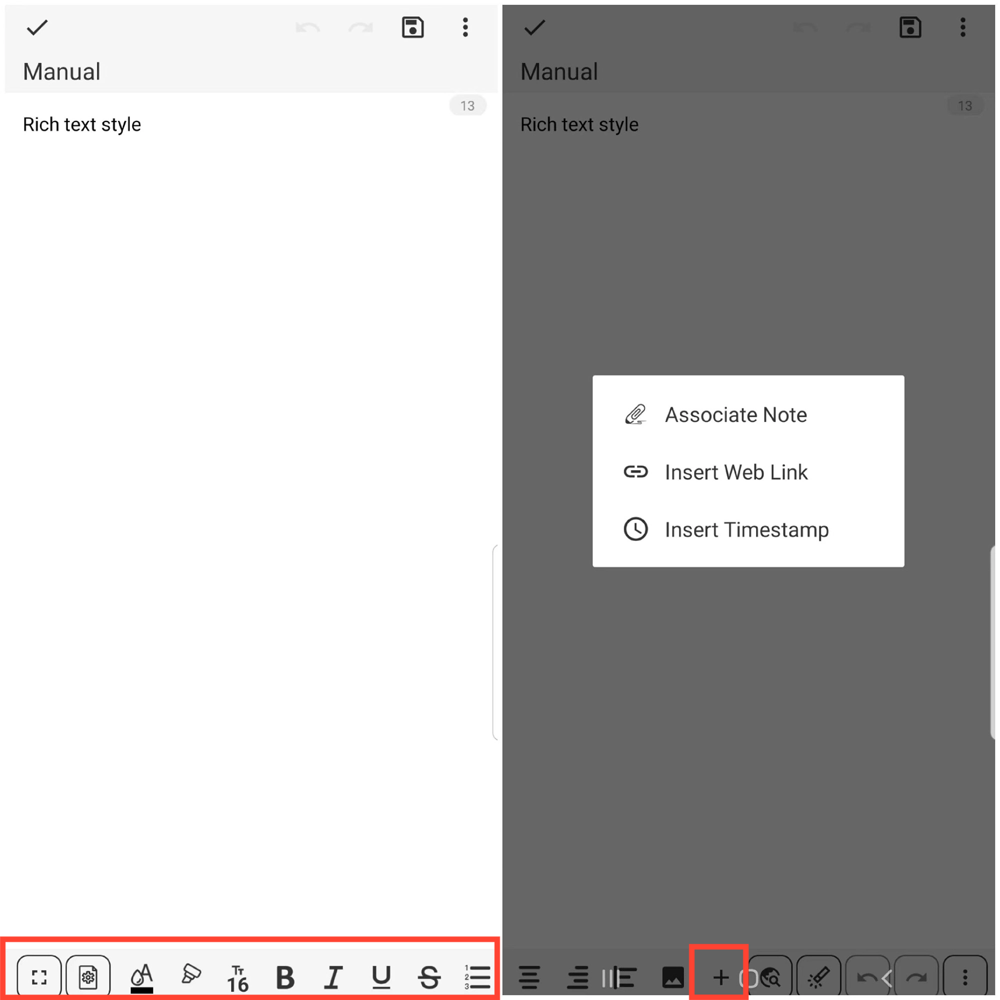

[Manual do Usuário](/dragonnest/drawnote/manual/pt) > [Nota de Texto](/dragonnest/drawnote/manual/pt/nota_de_texto) >

Estilo de Texto Avançado
---
O recurso de estilo de texto avançado da Nota de Texto oferece uma experiência de edição de texto mais diversificada.

Além de registrar facilmente texto, você também pode personalizar a cor da fonte, tamanho, negrito, itálico, sublinhado e outros estilos.

Além disso, introduzimos recursos de entrada rápida, como inserir links, inserir carimbos de data e hora e inserir imagens para aumentar sua eficiência de edição.

