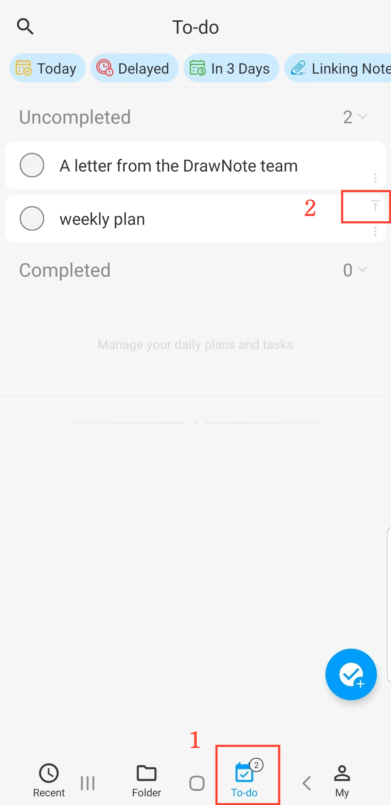

[Manual do Usuário](/dragonnest/drawnote/manual/pt) > [Tarefas](/dragonnest/drawnote/manual/pt/to_do) >

Criar um Novo Item na Lista de Tarefas
---
#### Passos

1. Navegue até a página 'Tarefas'.

2. Clique no botão "+".

3. Insira detalhes como o título, descrição e outras informações relevantes.

4. Toque no botão de confirmação no canto superior esquerdo para adicionar um novo item na lista de tarefas.

#### Dicas
1. Contagem de Tarefas - O número de tarefas pendentes é exibido na barra de guias inferior.

2. Fixar um Item da Lista de Tarefas - Na página 'Lista de Tarefas', toque no botão "alfinete" no canto superior direito de um item para mover tarefas importantes para o topo.

3. Mover para a Frente - Na tela 'Nova Tarefa', toque no botão "Mover para a Frente" na parte inferior para posicionar a tarefa no topo.

