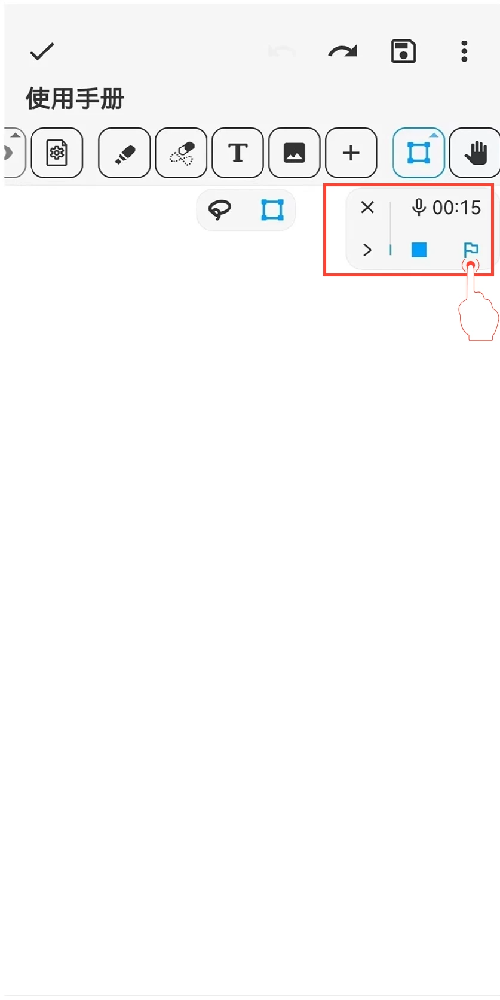
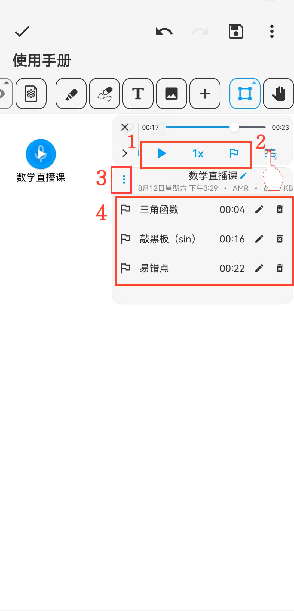

[用户手册](/dragonnest/drawnote/manual) > [超级笔记](/dragonnest/drawnote/manual/super_note) >

音频标记
---

音频标记类似于书签功能，它可以在录制音频时或在重听音频时帮助您快速标记关键内容。这有助于后续快速定位和重复收听重要部分。
#### 操作步骤

在录制音频或播放音频时，点击菜单中的“标记”按钮，即可在当前时间点插入一个标记。

#### 提示

1.在录音工具栏可调整音频播放速度、添加录音标记等。

2.点击录音工具栏右侧的“≡”按钮，展开菜单，您可修改录音名称和录音标记名称。

3.点击左侧“⋮”按钮可以下载音频。

4.在展开菜单栏中，您可看到标记记录。点击标记即可跳转到该标记时间点开始播放音频。

