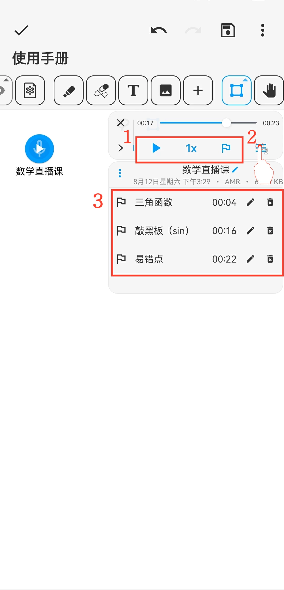

[用户手册](/dragonnest/drawnote/manual) > [超级笔记](/dragonnest/drawnote/manual/super_note) >

音频标记
---

音频标记类似于书签功能，它可以在录制音频时或在重听音频时帮助您快速标记关键内容。这有助于后续快速定位和重复收听重要部分。
#### 操作步骤

在播放音频或录制音频时，点击菜单中的“标记”按钮，即可在当前时间点插入一个标记。

#### 提示

1.在录音结束后，您可点击“录音工具栏”调整音频播放速度和添加录音标记。

2.点击录音条右侧的“≡”按钮，展开更多选项。展开菜单后，您可以添加录音和标记的备注名称。

3.点击展开标记记录，可以从该标记的时间点开始播放音频。

