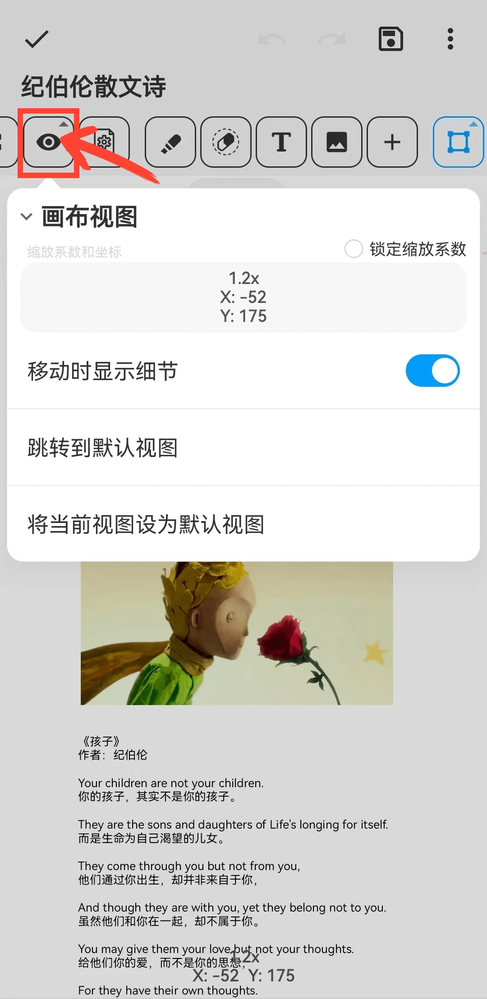

[用户手册](/dragonnest/drawnote/manual) > [超级笔记](/dragonnest/drawnote/manual/super_note) >

画布视图
---
画布视图是您查看和编辑笔记时的视图界面。视图中包含坐标和缩放信息。

#### 设置默认视图
当页面内容过多或页面过大时，您可以通过设置默认视图来将特定视图设定为默认显示位置。

点击“跳转到默认视图”按钮时，无论您当前位于页面的哪个位置，都可以迅速跳转到您设定的默认视图位置。这有助于更有效地浏览大页面或内容丰富的页面。

#### 锁定缩放系数
一旦勾选了“锁定缩放系数”，画布将被固定在当前的缩放级别，不再允许通过手势操作进行缩放。
