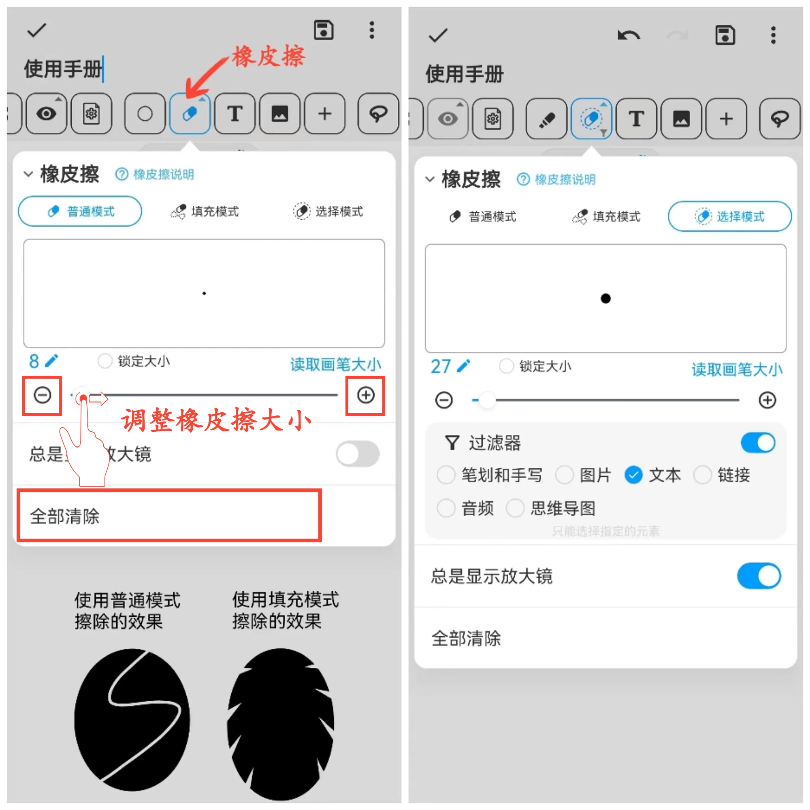

[用户手册](/dragonnest/drawnote/manual) > [超级笔记](/dragonnest/drawnote/manual/super_note) >

橡皮擦
---
橡皮擦提供三种模式：普通模式、填充模式和选择模式。
#### 操作步骤

点击工具栏中的“橡皮擦”按钮。

- 普通模式 -可以部分擦除所有元素（线条、文本、图片等）以模拟真实的橡皮擦效果。 在这种模式下，会留下擦除标记，即选择元素时可以选择擦除标记。

- 填充模式 - 与普通模式类似，该模式下以填充的效果快速擦除指定区域。

- 选择模式 - 可以快速消除整个选定的内容。此外，在选择模式下还可以打开过滤器，精确控制擦除特定的内容，例如仅擦除笔划或文字。在这种模式下，不会留下任何擦除痕迹。

#### 提示
- 点击“全部清除”可清除画布内的所有内容。

