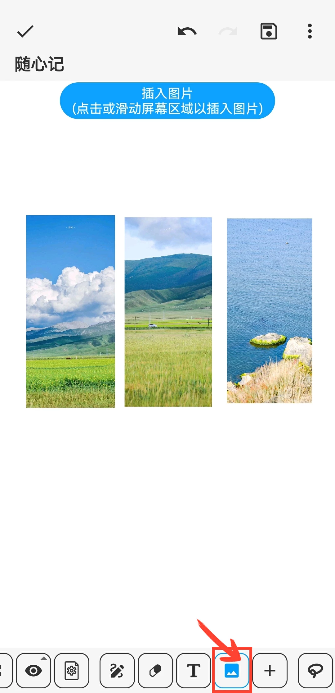
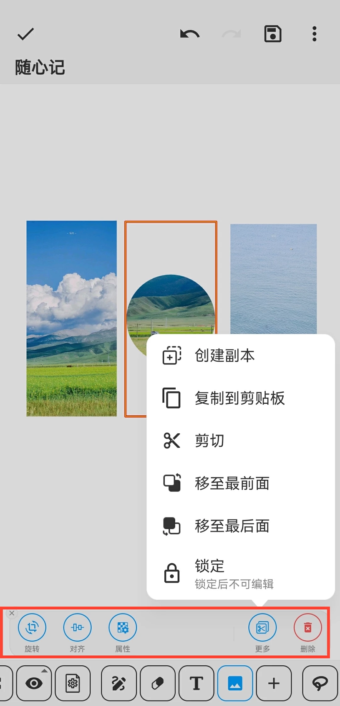

[用户手册](/dragonnest/drawnote/manual) > [超级笔记](/dragonnest/drawnote/manual/super_note) >

插入图片
---
#### 操作步骤

1.在工具栏中点击“图片”按钮

2.通过点击或滑动屏幕区域，即可在相应位置插入图片。

#### 提示
- 选择图片后，屏幕底部将弹出工具栏，其中提供了旋转、形状、透明度等编辑选项。

- 您可以与文字功能结合，将文字添加到图片上，从而标注图片内容，实现更加详细和准确的表达。

- 