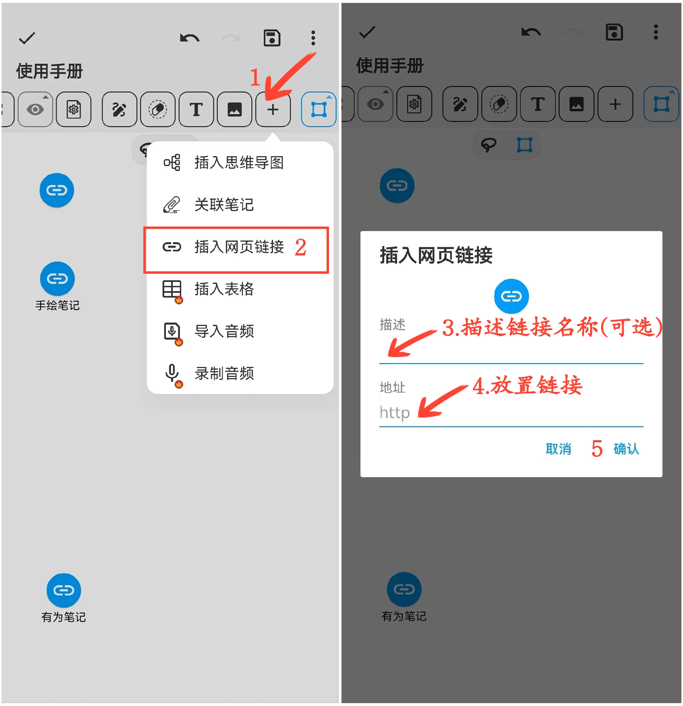

[用户手册](/dragonnest/drawnote/manual) > [超级笔记](/dragonnest/drawnote/manual/super_note) >

插入网页链接
---
#### 操作步骤

1.在工具栏中点击“+”按钮。

2.选择“插入网页链接”选项。

3.填写链接名称（可选）。

4.输入或粘贴网页链接。

5.确认操作后即可插入链接。

#### 提示
- 为链接取一个描述性名称，方便后续查找和定位。

- 在阅读模式下，点击链接图标即可直接访问网页。