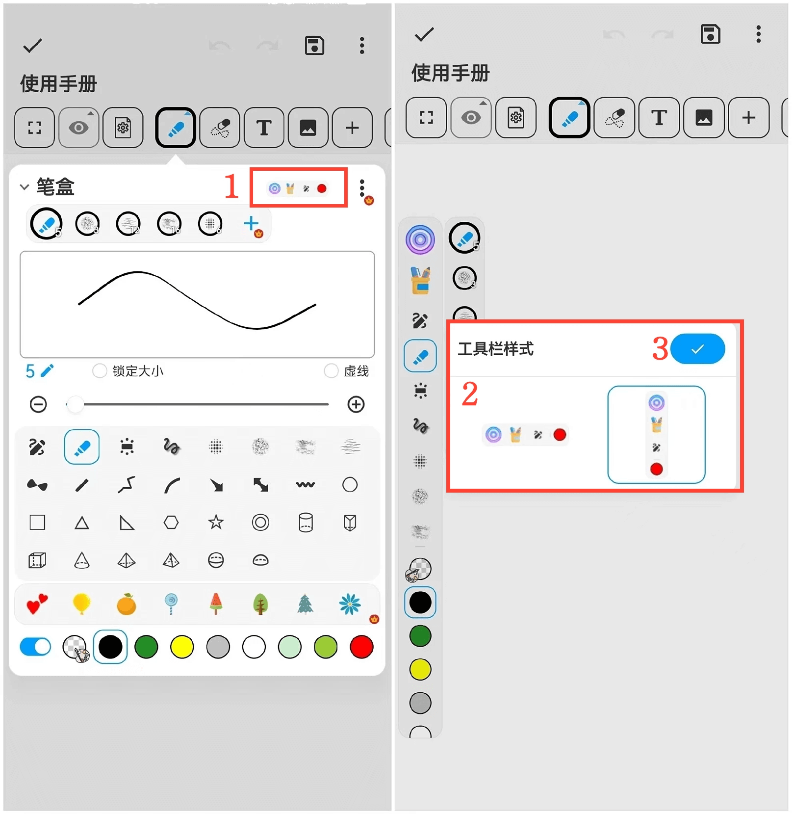
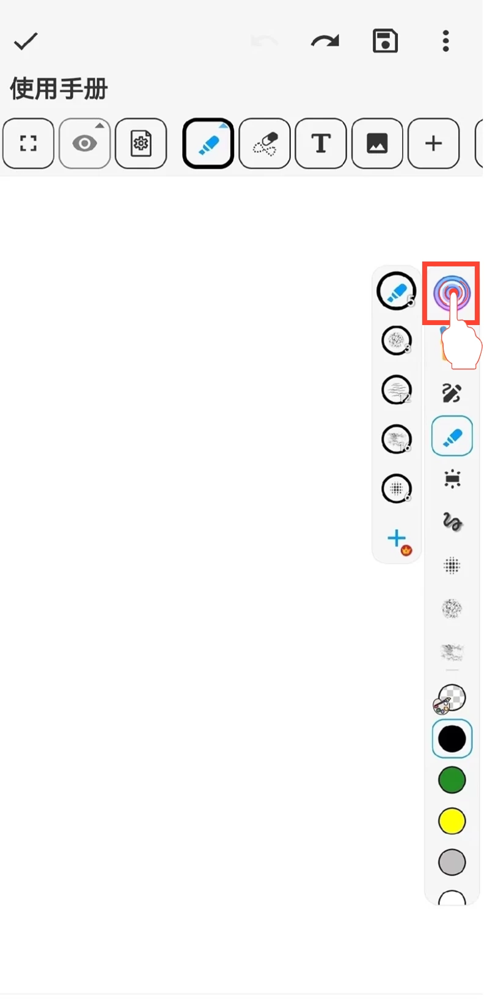

[用户手册](/dragonnest/drawnote/manual) > [超级笔记](/dragonnest/drawnote/manual/super_note) >

移动笔盒工具栏
---

您可以调整画笔工具栏在画布上的横向或竖向位置，轻松实现上下或左右移动。

#### 操作步骤

1.在笔盒页面，选择“工具栏样式”。

2.选择横向或竖向排列方式。

3.勾选确认。

#### 提示
- 按住笔盒工具栏上的圆形按钮，即可拖动笔盒工具栏并调整其位置。

