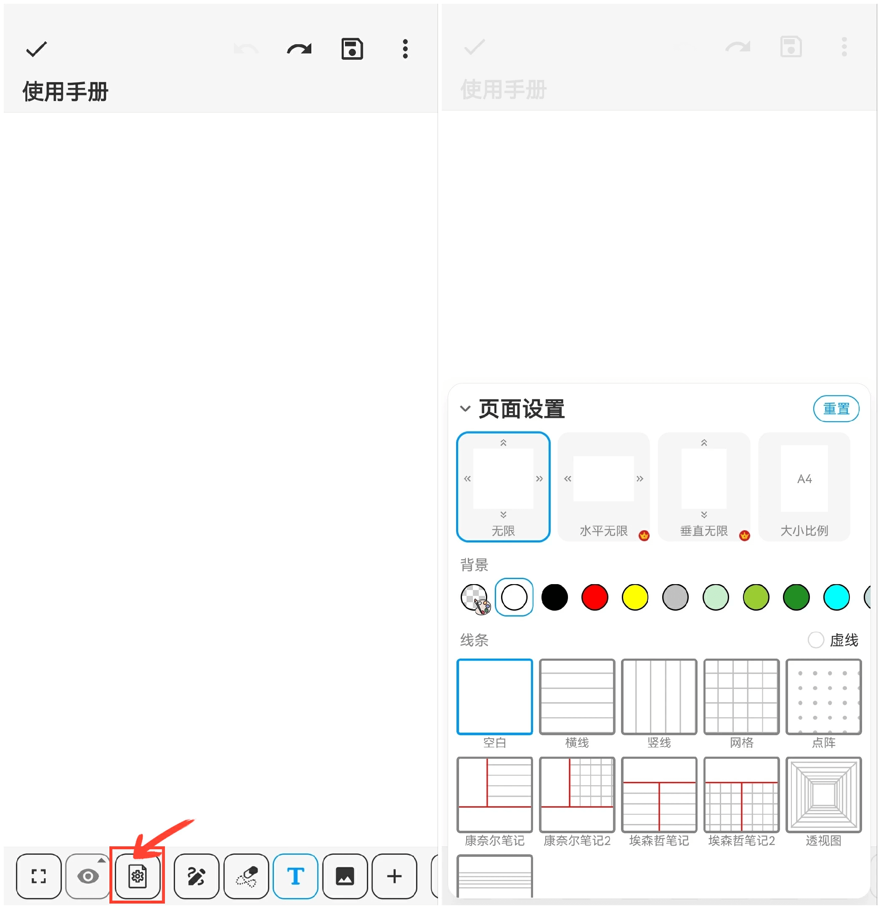

[用户手册](/dragonnest/drawnote/manual) > [超级笔记](/dragonnest/drawnote/manual/super_note) >

页面设置
---

您可以设置画布的方向、尺寸、背景颜色以及笔记线条等。

#### 操作步骤

点击工具栏中的“页面设置”按钮。

#### 无限画布

我们提供了无限、水平和垂直三种无限画布方向，以满足您不同的需求和偏好。

- 无限 - 横向和竖向均无限伸展，缩放范围为0.02x--200x。
- 水平无限 - 横向无限伸展，缩放范围为0.2x--1x。
- 垂直无限 - 竖向无限伸展，缩放范围为0.2x--1x。

#### 画布大小

点击“大小比例”，然后选择A4、A5等尺寸，或者自定义您需要的尺寸。

#### 画布背景和笔记线条

调整背景颜色，选择适合的线条样式，并可享有多样的笔记模板，有助于更好地整理和记录内容。

