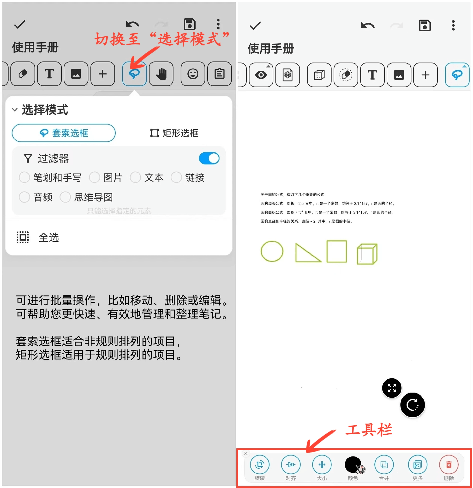

[用户手册](/dragonnest/drawnote/manual) > [超级笔记](/dragonnest/drawnote/manual/super_note) >

选择模式
---

在编辑模式下，笔记中的元素都可以被选中。在选择模式下，您有两种方式来选中元素：套索选框和矩形选框，这两种方式能够帮助您迅速选中所需的元素。

- 套索选框是一种自由曲线选框，它允许您通过自由绘制曲线来选中内容。

- 矩形选框是一种直角矩形选框，您可以直接划定方形的编辑区域来选中元素。

#### 操作步骤

1.在工具栏中点击“选择模式”按钮，并选择套索选框或矩形选框。

2.点击画布，滑动选择要编辑的内容，可以是单个元素或多个元素。

3.对选中元素可进行旋转、放大、缩小、合并、剪切、删除等操作。

#### 提示
在多种元素重叠时，可打开过滤器以精确选择指定内容，提高管理和整理效率。