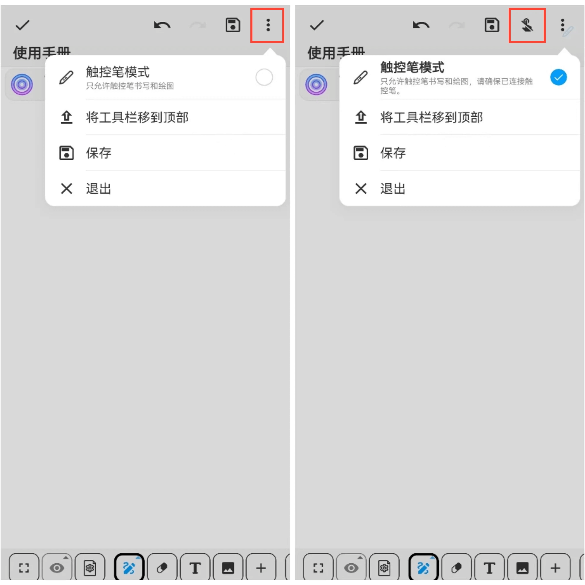

触控笔模式
---
#### 操作步骤

在超级笔记页面，点击屏幕右上方的“⋮”更多按钮，勾选触控笔模式即可。

#### 温馨提示：
- 在进入触控笔模式之前，请确保已成功连接上触控笔；
- 当您处于触控笔模式时，页面顶端将显示一个禁止手指的标志，以提醒您手指不可用；
- 在触控笔模式下，您可以放心地使用触控笔进行绘画，无需担心手指触碰屏幕会产生干扰；
- 如果您需要使用手指进行绘画，请切换到手指模式。
