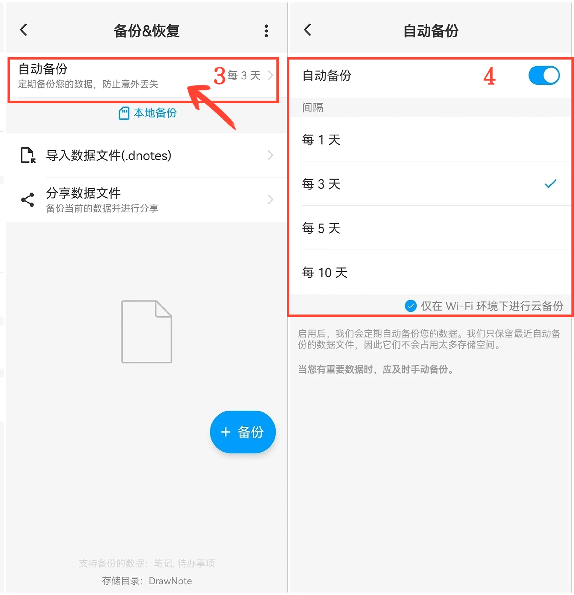

[使用說明](/dragonnest/drawnote/manual/zh) > [資料備份與還原](/dragonnest/drawnote/manual/zh/data_backup_and_recovery) >

自動備份
---
#### 操作步驟

1. 在主畫面點擊「我的」。

2. 進入“備份&還原”選項。

3. 點擊"自動備份"選項。

4. 開啟 "自動備份" 按鈕並選擇備份間隔時間，以保護資料並因應意外情況。

