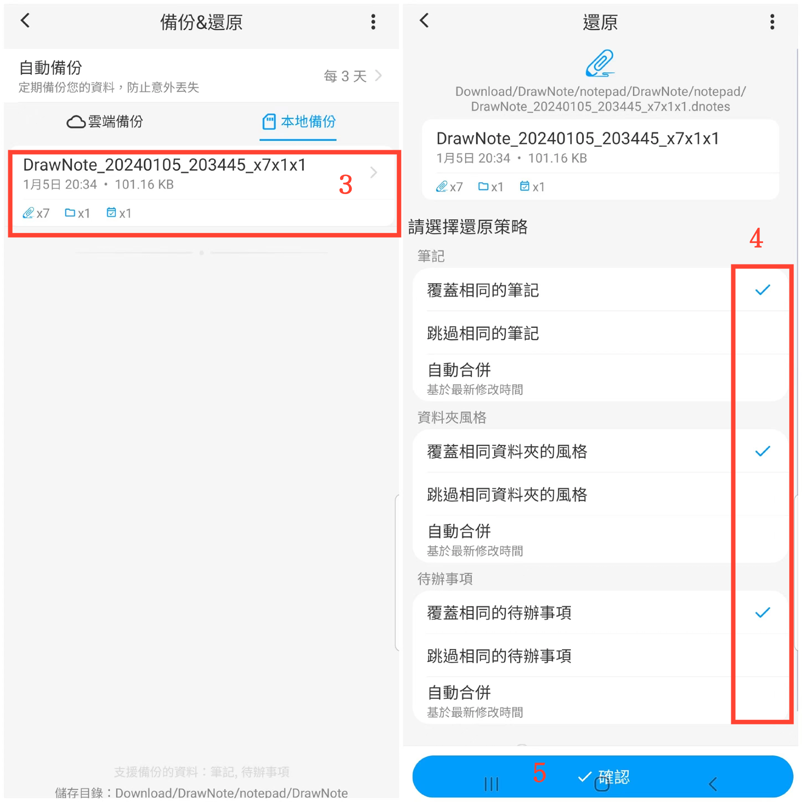

[使用說明](/dragonnest/drawnote/manual/zh-tw) > [資料備份與還原](/dragonnest/drawnote/manual/zh-tw/data_backup_and_recovery) >

資料恢復
---
#### 操作步驟

1. 在主畫面點擊「我的」。

2. 進入“備份&還原”選項。

3. 點擊文件條以選擇備份文件。

4. 勾選適當的選項。

5. 點擊"確認"，以恢復資料。

#### 提示
備份資料恢復時，有以下三種策略可供選擇：
- 覆蓋相同的筆記 - 將備份內容替換目前筆記。
- 跳過相同的筆記 - 當備份內容與目前筆記相同時，目前筆記保持不變。
- 自動合併 - 基於最新修改時間合併備份和現有筆記。

根據需求選擇合適策略，並定期備份以防資料丟失。