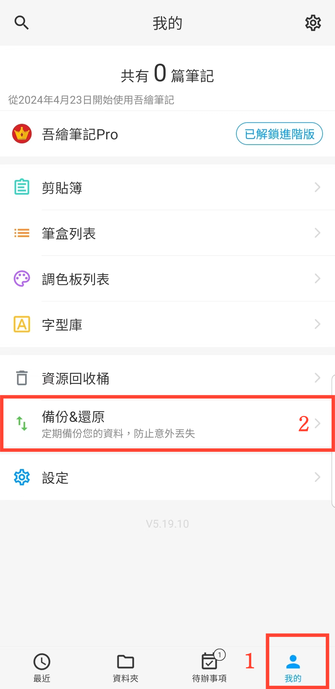

[使用手冊](/dragonnest/drawnote/manual/zh-tw) >

資料備份與還原
---

使用資料備份與還原功能，您可以輕鬆保護重要資訊，避免意外遺失。

- [資料備份](data_backup.md)

- [自動備份](automatic_backup.md)

- [資料恢復](data_recovery.md)

- [管理備份資料](manage_backup_data.md)

