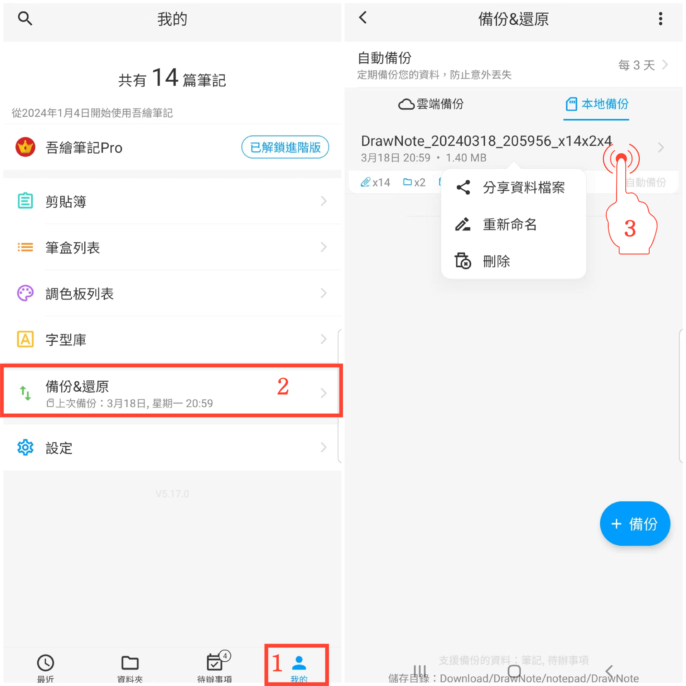

[使用說明](/dragonnest/drawnote/manual/zh-tw) > [資料備份與還原](/dragonnest/drawnote/manual/zh-tw/data_backup_and_recovery) >

管理備份資料
---
#### 操作步驟

1. 在主畫面點擊「我的」。

2. 進入“備份&還原”選項。

3. 長按文件條以管理資料恢復項目，您可以進行分享、重新命名和刪除操作。

