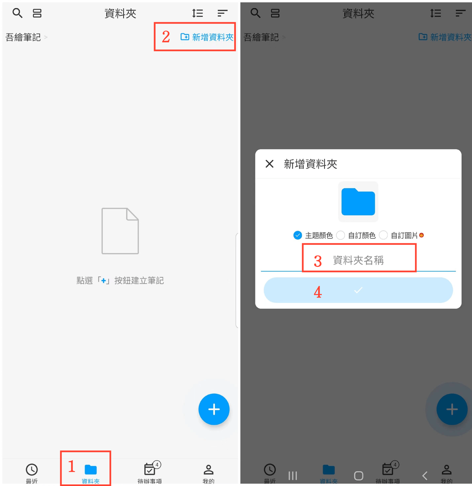

[使用說明](/dragonnest/drawnote/manual/zh) > [資料夾](/dragonnest/drawnote/manual/zh/folder) >

新增
資料夾
---
#### 操作步驟

1. 在主畫面點擊「資料夾」。

2. 點擊右上角的“新增
資料夾”按鈕。

3. 輸入資料夾名稱。

4. 點擊確認按鈕。

#### 提示
- 您可在新增
或編輯資料夾時選擇資料夾的顏色或自定義封面。