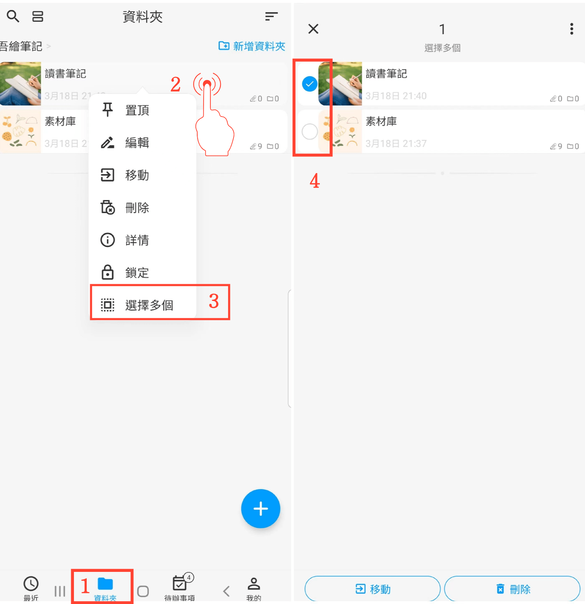

[使用說明](/dragonnest/drawnote/manual/zh-tw) > [資料夾](/dragonnest/drawnote/manual/zh-tw/folder) >

選擇多個資料夾或筆記
---

#### 操作步驟
1.在主畫面點擊「資料夾」。

2.長按某個資料夾或筆記。

3.在彈出菜單中點擊“選擇多個”，進入多選模式。

4.選中要修改的資料夾或筆記，執行批量移動或刪除等操作。

