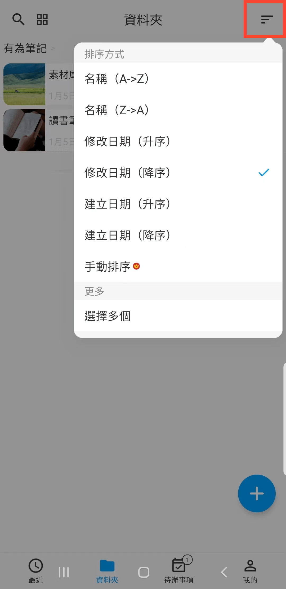
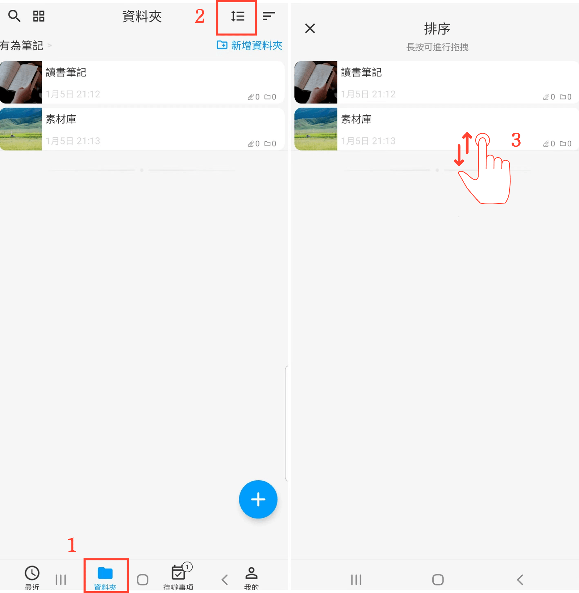

[使用說明](/dragonnest/drawnote/manual/zh) > [資料夾](/dragonnest/drawnote/manual/zh/folder) >

資料夾排序
---
文件排序有多種方式，您可用名稱、修改日期、創建日期等方式進行排序，也可以手動排序。

#### 選擇排序方式
在「資料夾」頁面，點擊"排序方式"按鈕，選擇你需要的排序方式。

#### 手動排序
1. 在「資料夾」頁面。

2. 點擊"手動排序"按鈕。

3. 長按並上下拖拽，以調整排列順序。

