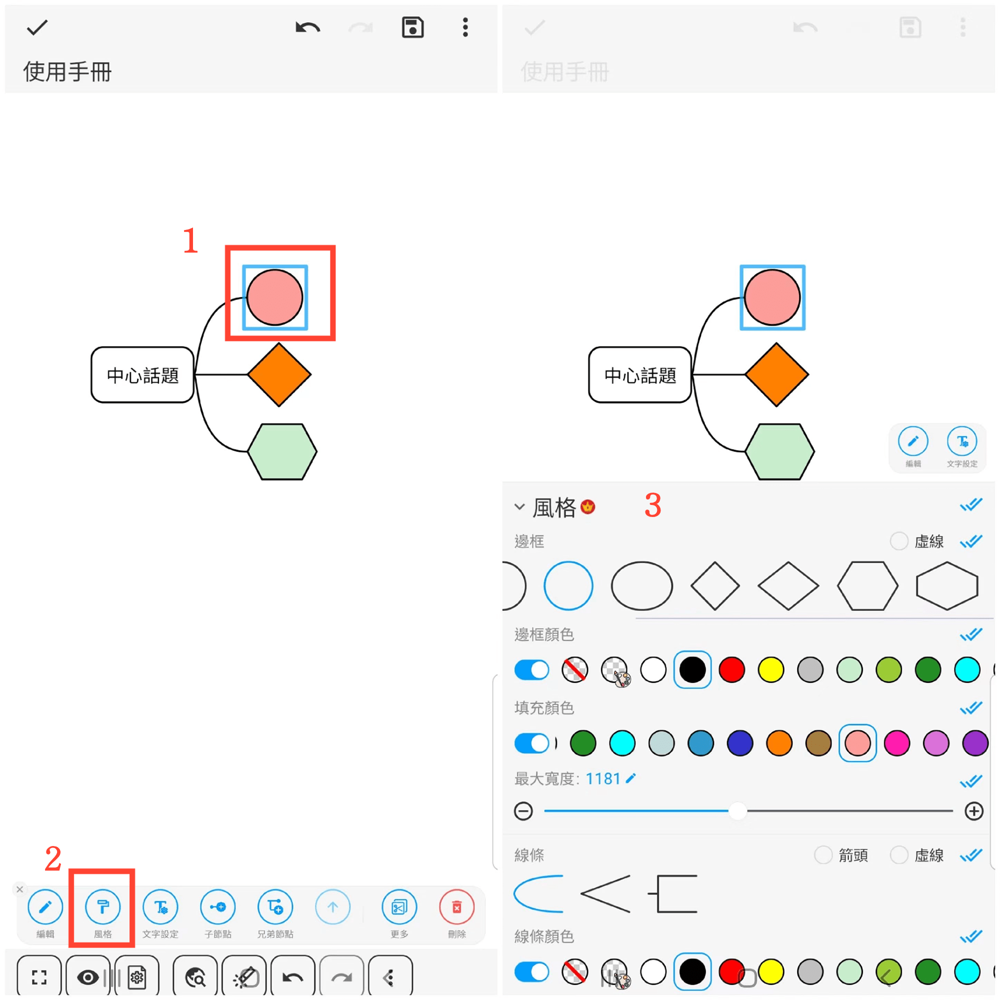
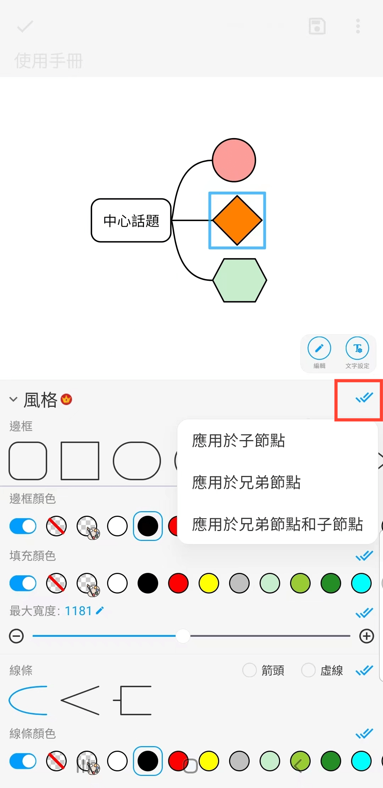

[使用手冊](/dragonnest/drawnote/manual/zh-tw) > [心智圖](/dragonnest/drawnote/manual/zh-tw/mind_mapping) >

邊框與線條風格
---
#### 操作步驟

1. 點擊要設定的節點框。

2. 點擊“風格”選項卡。

3. 在彈出的窗口中，選擇所需的風格選項，如邊框形狀、邊框顏色、填充顏色、線條樣式和線條顏色。

#### 提示

點擊右側的藍色雙對勾符號，可選擇將風格應用於子節點、兄弟節點，或兄弟節點和子節點。

