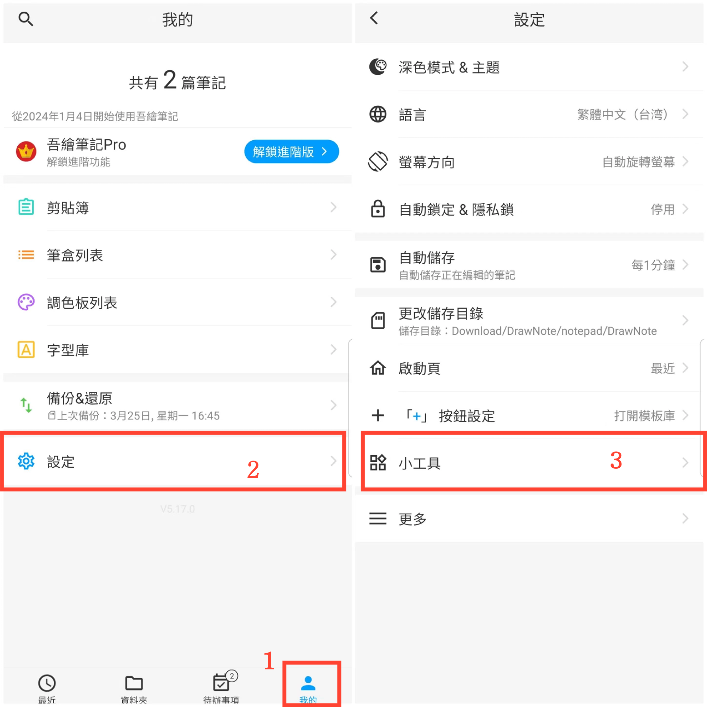

[用户手册](/dragonnest/drawnote/manual/zh-tw) > [更多](/dragonnest/drawnote/manual/zh/more) >

添加桌面小工具
---
透過將桌面小工具新增至您的裝置主畫面，您可以輕鬆快速地存取筆記編輯功能，而無需開啟應用程式。
### 操作步驟
1. 在主畫面點擊「我的」。
2. 進入設定。
3. 點擊"小工具"，選擇要新增的工具類型。

#### 提醒
您也可以直接在裝置桌面進入新增小外掛設定，找到該應用程式，然後新增桌面小外掛。
