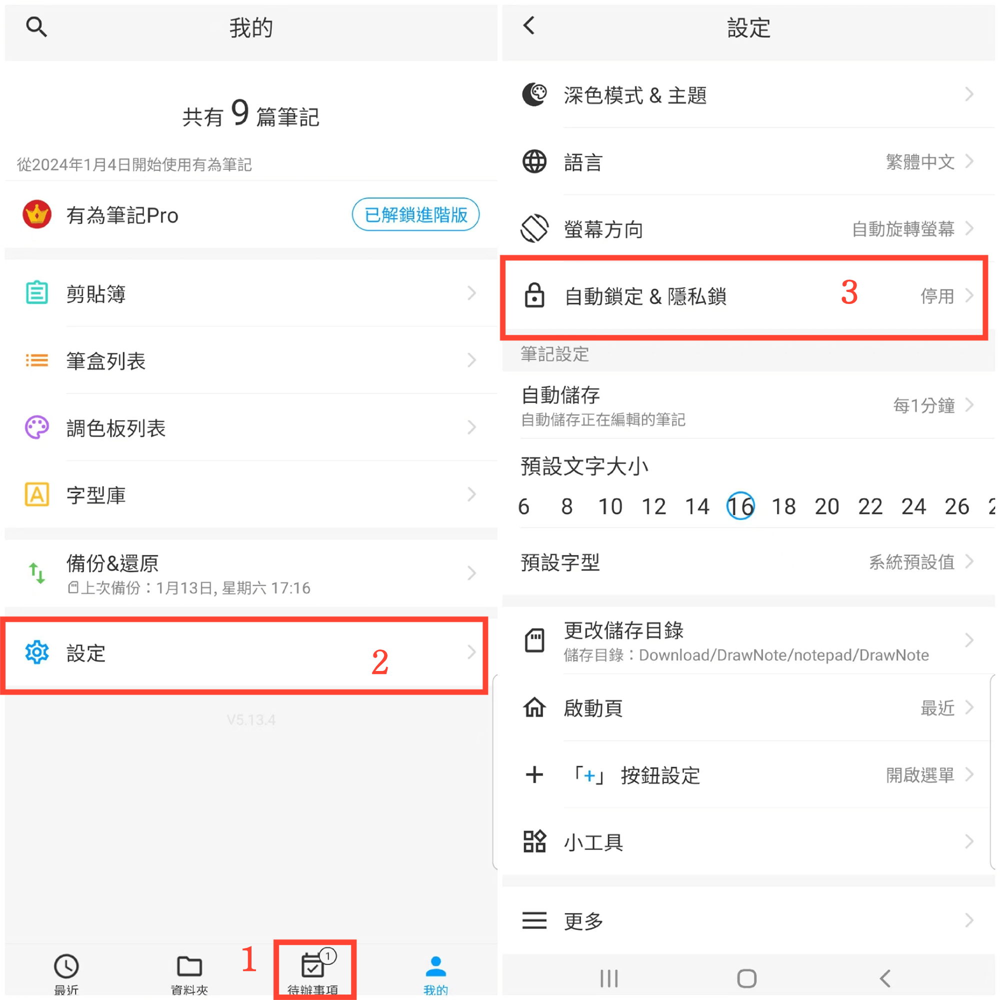
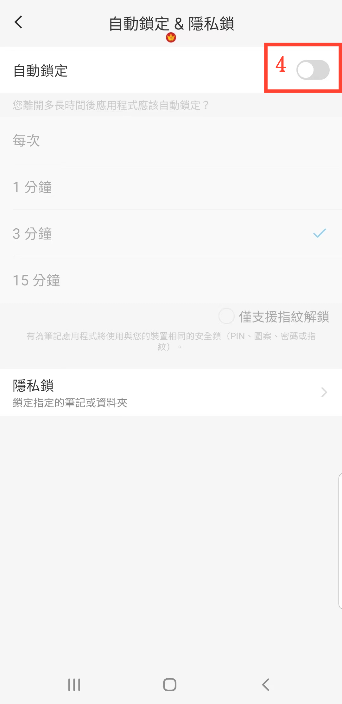

[使用說明](/dragonnest/drawnote/manual/zh) > [更多](/dragonnest/drawnote/manual/zh/more) >

自動鎖定
---
自動鎖定是指應用程序會在您離開一段時間後自動鎖定，以增加隱私和數據安全，防止未經授權的訪問。
#### 操作步驟

1. 點擊主頁的「我的」。

2. 進入設定。

3. 點擊"自動鎖定&隱私鎖"。

4. 開啟"自動鎖定"按鈕，選擇自動鎖定時間。

