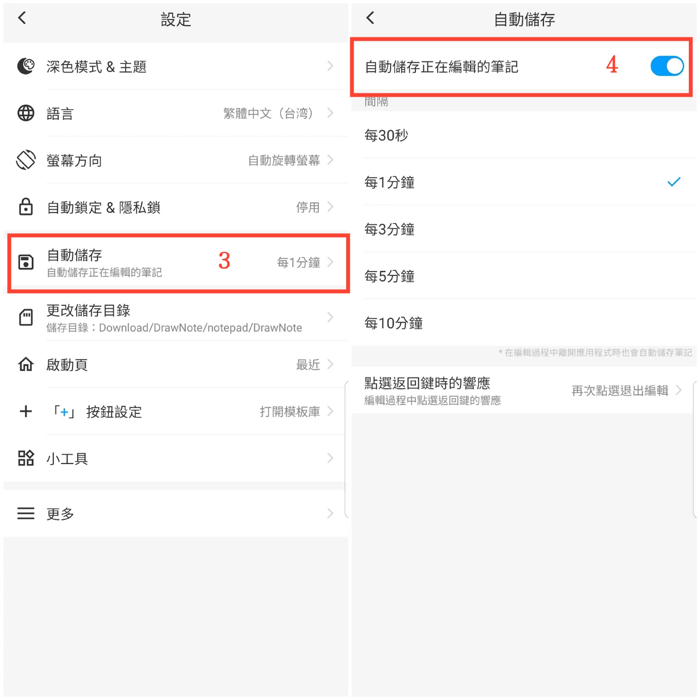

[使用說明](/dragonnest/drawnote/manual/zh-tw) > [更多](/dragonnest/drawnote/manual/zh-tw/more) >

自動儲存
---
自動儲存可防止數據意外丟失。

#### 操作步驟

1. 點擊主頁的「我的」。

2. 進入設定。

3. 點擊"自動儲存"按鈕。

4. 開啟按鈕，選擇自動儲存時間。

#### 提示
- 編輯筆記時按系統返回鍵的提示可自定義。響應方式包括：再次點擊退出編輯、請求確認和儲存並退出。

