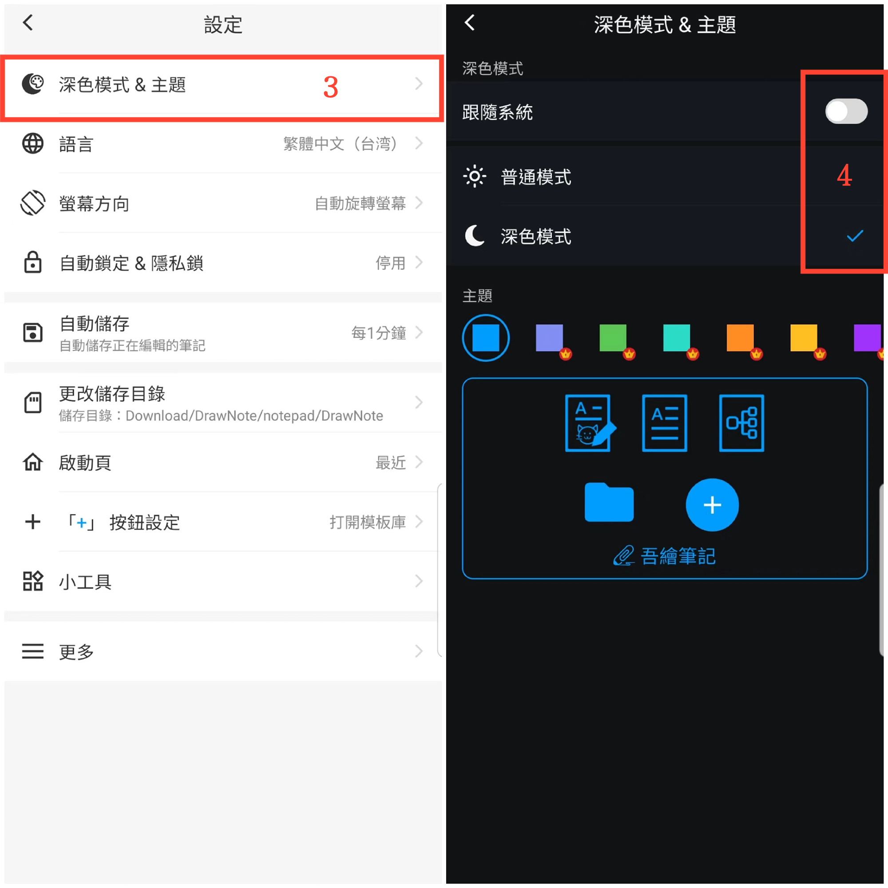

[使用手冊](/dragonnest/drawnote/manual/zh-tw) > [更多](/dragonnest/drawnote/manual/zh-tw/more) >

深色模式和主題色切換
---
深色模式提供更加舒適的閱讀體驗，有助於減少眼睛疲勞並保護視力健康。這一功能使您能夠輕鬆切換到更舒適的深色模式，並根據個人喜好選擇主題顏色。

### 操作步驟
1. 在主螢幕上點選「我的」。
2. 進入設定。
3. 點選"深色模式&主題"。
4. 在此處，您可以切換深色模式並選擇不同的主題顏色以定製個性化介面。

