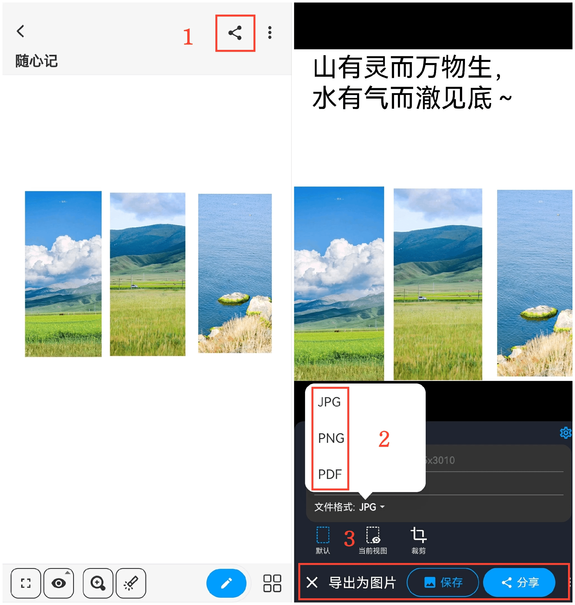
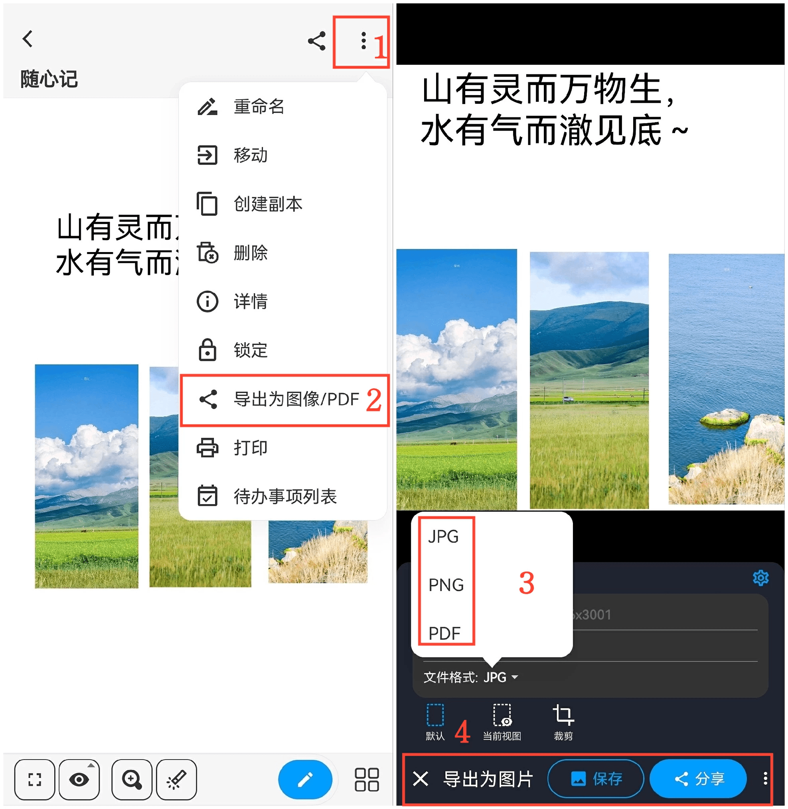

[使用說明](/dragonnest/drawnote/manual/zh) > [更多](/dragonnest/drawnote/manual/zh/more) >

導出/分享筆記
---
有兩種方法可以導出/分享筆記。

#### 方法一
1. 在閱讀模式下，點擊畫布右上角的“分享”圖標。

2. 選擇您希望導出的筆記文件格式。

3. 選擇“保存”或“分享”，然後選擇分享途徑，完成操作。

#### 方法二
1. 在閱讀模式下，點擊右上方的“⋮”更多圖標。

2. 選擇“導出為圖像/PDF”。

3. 選擇您希望導出的筆記文件格式。

4. 點擊“保存”或“分享”，然後選擇分享途徑，完成操作。

