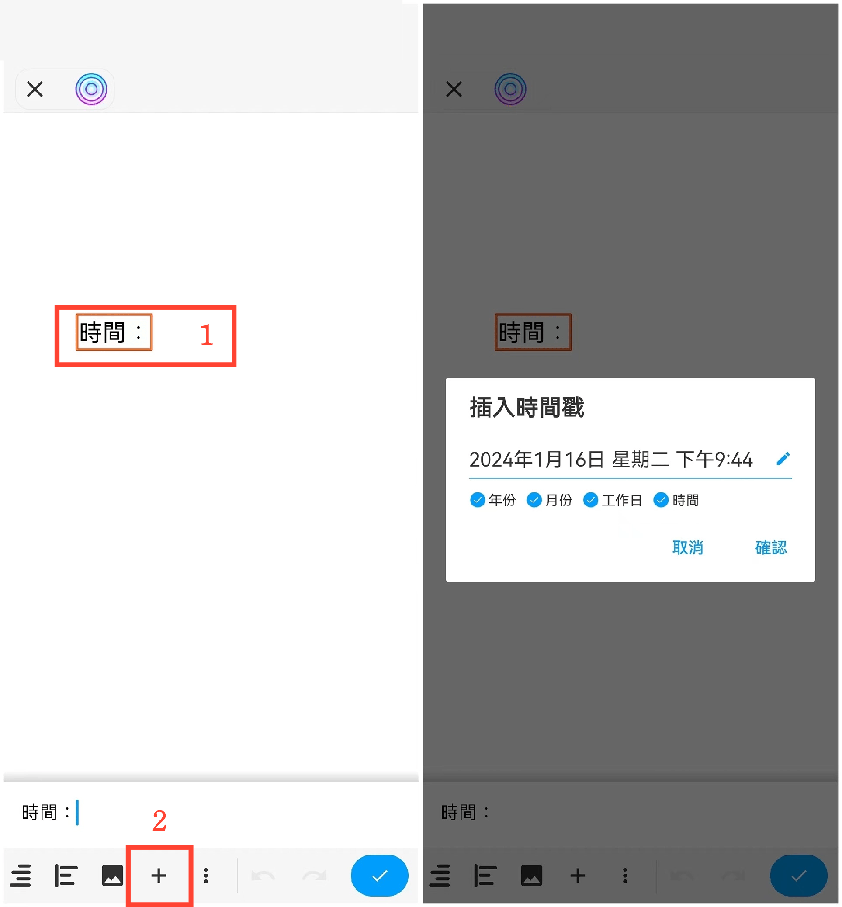

[使用說明](/dragonnest/drawnote/manual/zh-tw) > [更多](/dragonnest/drawnote/manual/zh/more) >

插入時間戳
---
插入時間戳可以方便地記錄筆記的時間。

#### 操作步驟
在文字筆記中，向左滑動點擊“+”號，選擇“插入時間戳”，點擊確認，即可。

在超級筆記和心智圖中需選中文本框，打開文字菜單欄，然後向左滑動點擊“+”號，選擇“插入時間戳”，點擊確認。

