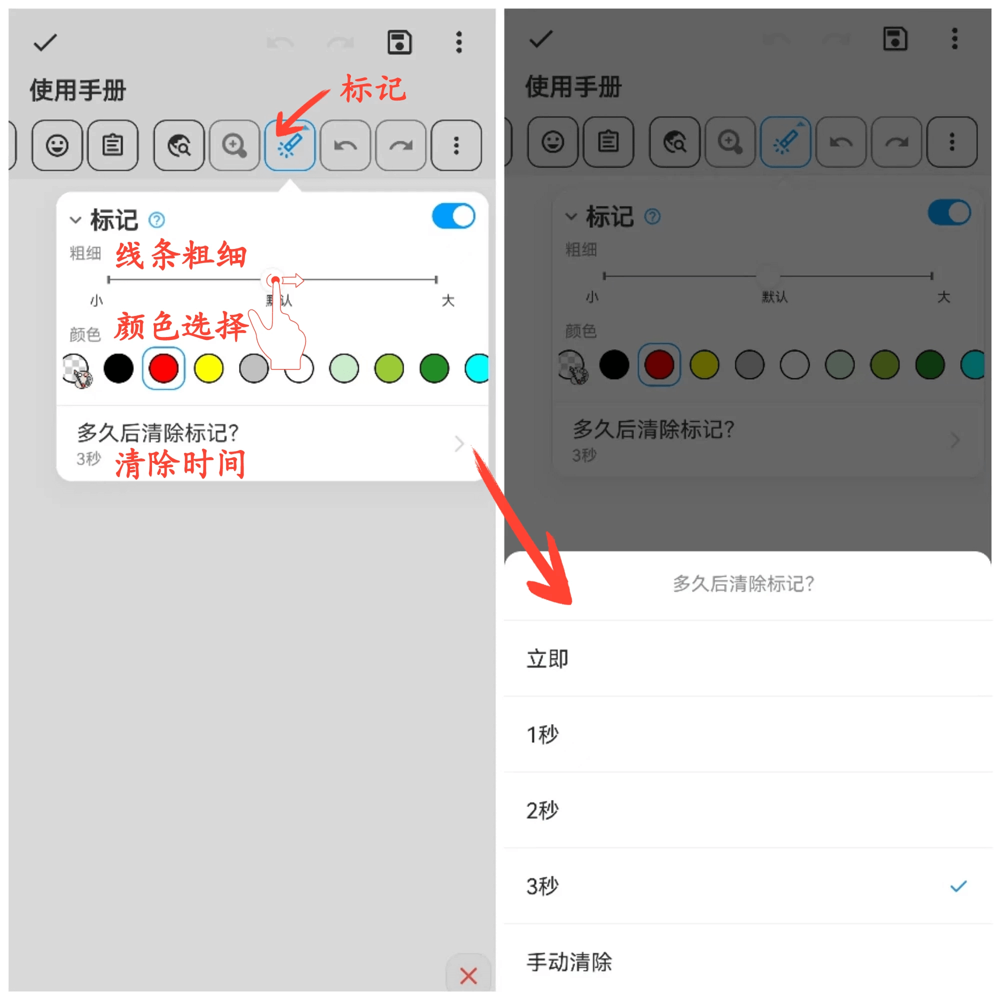

[使用說明](/dragonnest/drawnote/manual/zh-tw) > [更多](/dragonnest/drawnote/manual/zh-tw/more) >

標記功能
---
標記功能可以幫助您發現重點並吸引注意力，適用於教學和演示。

#### 操作步驟
1. 點擊工具列中點擊“標記”按鈕，即可在畫布中進行標記演示。

2. 您可以調整標記線條粗細和選擇標記顏色。

3. 此外，您還可以設定標記自動清除時間或手動清除標記。

#### 提示
標記功能用於演示，退出畫布後標記會被刪除。如果需要突顯顯示內容並永久儲存，可以進入編輯模式，使用畫筆工具進行標記。