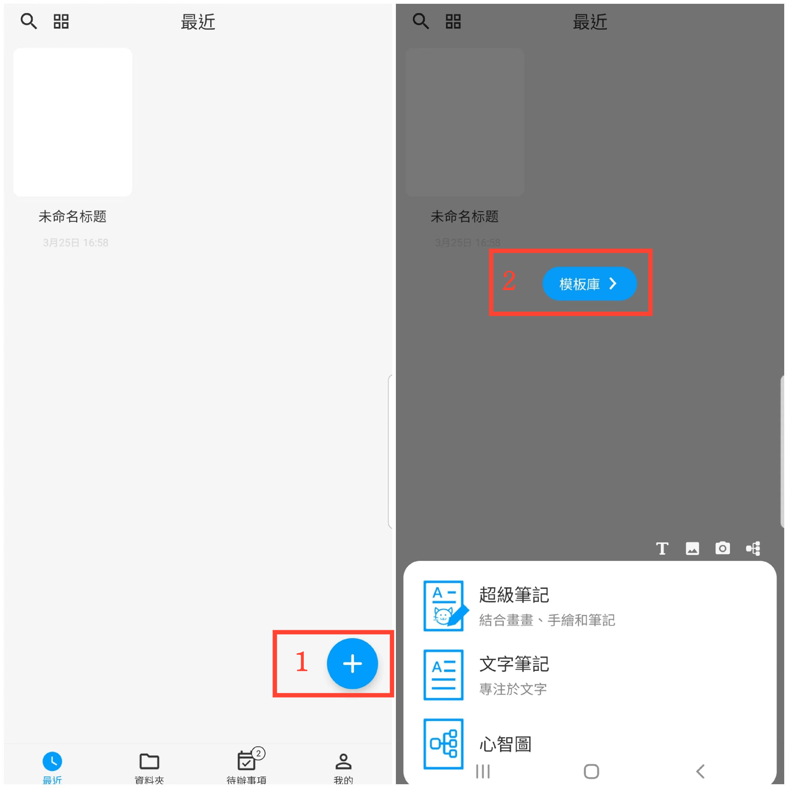

[使用者手冊](/dragonnest/drawnote/manual/zh) > [更多](/dragonnest/drawnote/manual/zh/more) >

建立模板
---
透過建立模板，您可以在新建筆記時自動應用該模板的配置，例如背景顏色、字型大小、字型顏色等常用設定。
### 操作指南
1. 在應用首頁，點選右下角的“+”圖示。
2. 點選“模板庫”。
3. 在所需的筆記型別後選擇“新建模板”。
4. 進入模板編輯頁面進行設定，包括背景顏色，字型大小，字型顏色等，配置完成後儲存即可。

#### 提示
長按模板庫可以獲取更多選項,如檢視和編輯模板、設為預設模板等。

