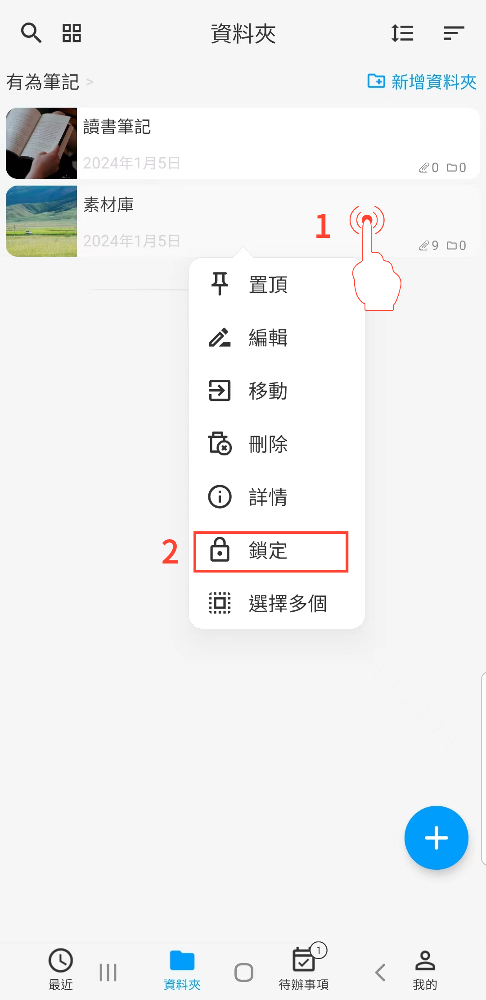

[使用說明](/dragonnest/drawnote/manual/zh-tw) > [更多](/dragonnest/drawnote/manual/zh-tw/more) >

隱私鎖
---
通過隱私鎖，您可以鎖定指定的筆記和文件夾。
#### 操作步驟

1. 長按需要鎖定/解鎖的筆記或文件夾。

2. 在彈出的菜單欄中點擊“鎖定“/”解鎖”，即可鎖定/解鎖筆記或文件夾。

#### 提示
- 鎖定的內容無法直接搜索。

- 在「我的」，"自動鎖定&隱私鎖"界面，您可設定隱私鎖指紋解鎖或者密碼解鎖。

- 隱私鎖是一種本地臨時鎖定機制。這意味著，當您對筆記進行加鎖並將其備份後，然後在其他設備上恢復這些筆記時，並不需要再次解鎖即可檢視其內容。