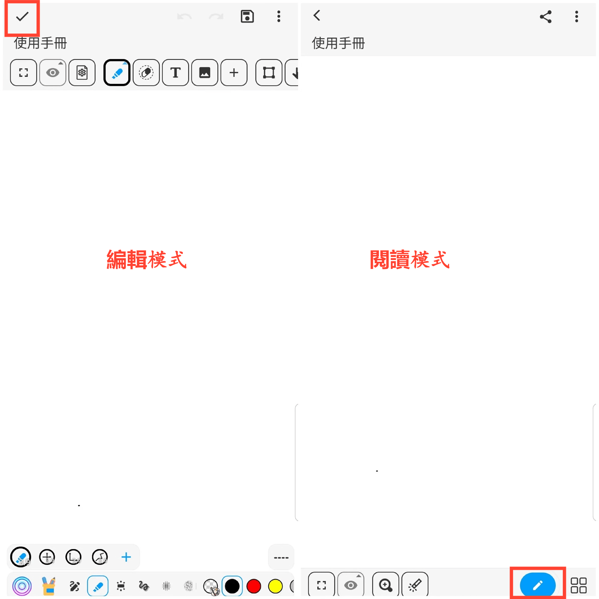

[使用說明](/dragonnest/drawnote/manual/zh) > [更多](/dragonnest/drawnote/manual/zh/more) >

閱讀模式和編輯模式
---
閱讀模式和編輯模式是筆記的兩種狀態，用於檢視
和修改筆記內容。

#### 閱讀模式
- 選擇要檢視
的筆記，單擊進入閱讀模式。

- 如果您正在編輯筆記，請點擊左上方的“√”圖標，以切換到閱讀模式。

#### 編輯模式
- 如果您正在閱讀筆記，請點擊右下方“畫筆”圖標，以切換到編輯模式，進行筆記修改和編輯。

在閱讀模式下，您可以：

- 檢視
筆記內容，放大縮小以獲取信息。

- 跳轉關聯筆記，獲取更多相關信息。

- 點擊網頁鏈接圖標，跳轉到相關網頁。

- 檢視
、保存或分享筆記中的圖片。

- 點擊右上方“⋮”圖標，進行重命名、移動、刪除、導出等操作。

- 點擊下方工具列，進行預設視圖跳轉、標記、放大、切換筆記、新增
文件夾等操作。