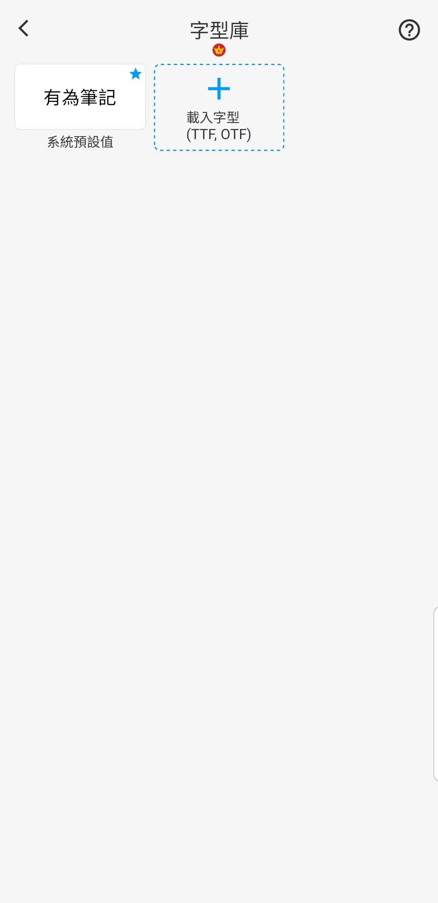

[使用說明](/dragonnest/drawnote/manual/zh) > [更多](/dragonnest/drawnote/manual/zh/more) >

設定預設字型
---
字型庫可以儲存常用的字型，您可以在文字筆記或者文本編輯框中為文字選擇字型。

#### 添加字型
1. 點擊主頁的「我的」。

2. 進入設定。

3. 點擊 "預設字型"。

4. 選擇您需要的字型。

#### 提示
除了設定預設字型，您可以在設定頁面，設定畫筆色板顏色位置、設定預設文本大小等。