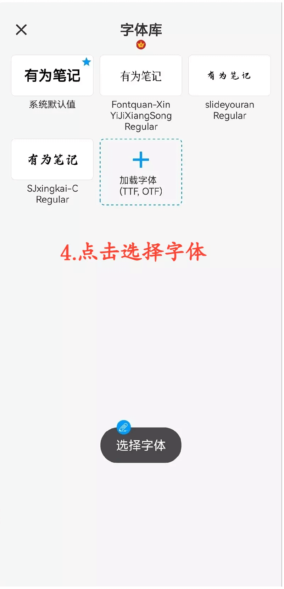

[使用說明](/dragonnest/drawnote/manual/zh) > [更多](/dragonnest/drawnote/manual/zh/more) >

設置預設字體
---
字體庫可以保存常用的字體，您可以在文字筆記或者文本編輯框中為文字選擇字體。

#### 添加字體
1. 點擊主頁的「我的」。

2. 進入設置。

3. 點擊 "預設字體"。

4. 選擇您需要的字體。

#### 提示
除了設置預設字體，您可以在設置頁面，設置畫筆色板顏色位置、設置預設文本大小等。