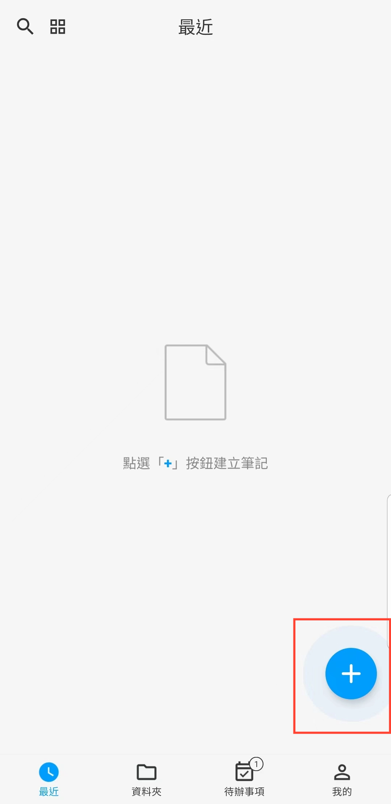
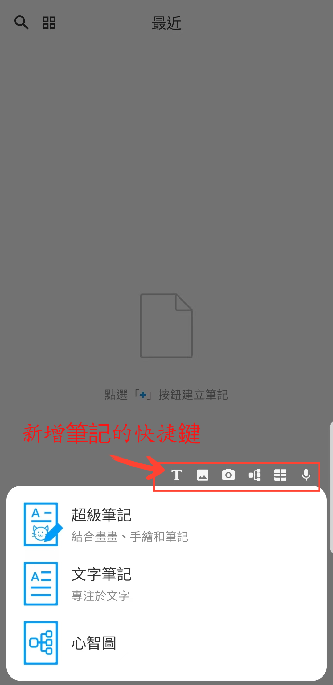

[使用手冊](/dragonnest/drawnote/manual/zh-tw) >

新增筆記
---
吾繪筆記提供多種靈活的筆記類型，包括超級筆記、文字筆記和心智圖，以滿足不同的使用場景。

- 超級筆記 - 將手寫、繪圖、文字、圖片、錄音、表格、心智圖等元素融合在一起，利用靈活的畫布充分表達您的創意和藝術才華。

- 文字筆記 - 專注於文字記錄，支援富文本設置以及插入圖片，讓您的記錄更具多樣性和可視化。

- 心智圖 - 幫助您迅速捕捉想法並整理知識，以清晰的圖形結構展現複雜的概念。

#### 操作步驟

在應用首頁，點擊右下角的“+”號，選擇要創建的筆記類型，開始創作。

#### 提示

- 在「文件夾」處點擊“+”按鈕新增筆記時，新筆記將自動分類至目前文件夾。

- 您還可以利用菜單頂部的快捷入口，快速進入超級筆記的不同功能創作界面。

