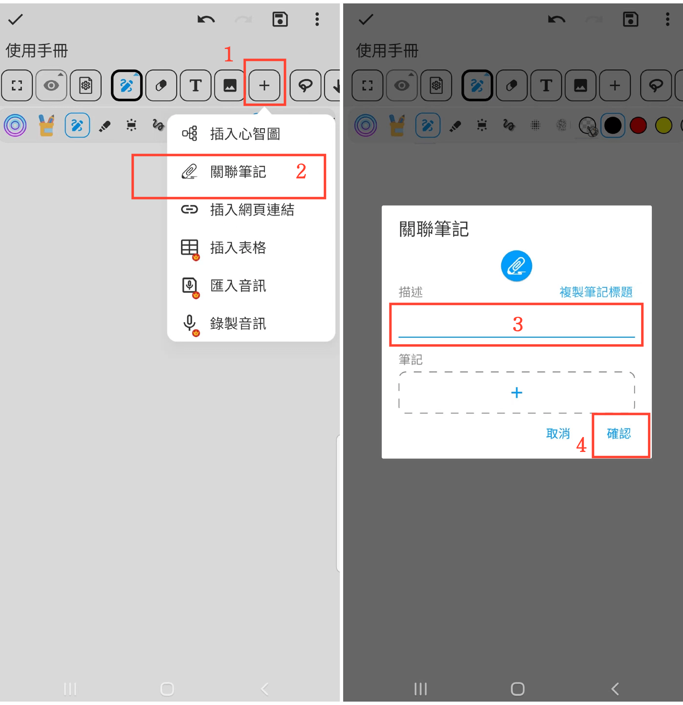

[使用說明](/dragonnest/drawnote/manual/zh-tw) > [超級筆記](/dragonnest/drawnote/manual/zh-tw/super_note) >

關聯筆記
---

關聯筆記功能讓您輕鬆連接相關筆記，提升筆記組織和查找效率。
#### 操作步驟

1. 在工具列中點擊“+”按鈕。

2. 點擊“關聯筆記”，選擇要關聯的筆記。

3. 為關聯筆記命名（可選）。

4. 點擊“確認”，即可將需要關聯的筆記添加到目前筆記中。

#### 提示

- 為關聯筆記命名有助於更快地查找和管理。

- 利用“時間順序”或“資料夾”篩選可更快地選取筆記。