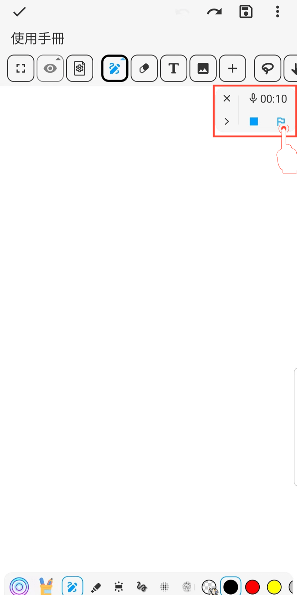
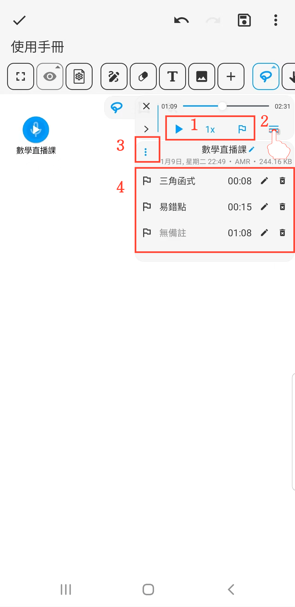

[使用手冊](/dragonnest/drawnote/manual/zh-tw) > [超級筆記](/dragonnest/drawnote/manual/zh-tw/super_note) >

音訊標記
---
音訊標記類似於書籤，可在錄製或重聽音訊時幫助您快速定位和重複關鍵部分。

#### 操作步驟

在錄音或播音時，點擊“標記”按鈕可插入目前時間的標記。

#### 提示

1. **調整音訊速度和添加標記** - 在工具列中輕松完成。

2. **修改錄音和標記名稱** - 點擊右側的“≡”按鈕，然後點擊“畫筆”按鈕。

3. **下載音訊** - 點擊左側的“⋮”按鈕即可下載。

4. **檢視音訊標記記錄** - 在展開菜單中檢視標記，點擊標記即可快速跳轉播放音訊。

