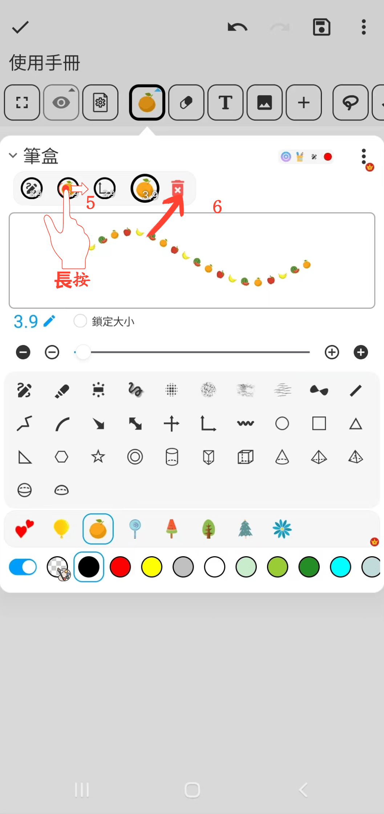

[使用說明](/dragonnest/drawnote/manual/zh) > [超級筆記](/dragonnest/drawnote/manual/zh/super_note) >

畫筆功能
---

#### 操作步驟

點擊工具列中的“畫筆”按鈕，可進行以下操作。

#### 1.收藏多個畫筆

點擊筆盒收藏欄中的“+”按鈕，可添加不同類型的畫筆。

#### 2.鎖定畫筆大小

勾選“鎖定大小”按鈕，可使畫筆大小固定。即使對畫布或頁面進行縮放，畫筆大小也不會隨之改變。

#### 3.虛線效果

勾選“虛線”按鈕即可應用虛線畫筆效果。

#### 4.調整畫筆大小

使用中間的滑動條或兩邊的“+”和“-”按鈕，以調整筆畫的大小。

#### 5.調整畫筆位置
在筆盒欄中，長按需要調整位置的畫筆，然後左右拖動至適當位置，釋放即可完成調整。

#### 6.刪除收藏的畫筆

在筆盒欄中，長按需要刪除的畫筆，然後向右拖動至“回收桶”圖標上釋放，即可刪除該畫筆。

#### 保存常用筆盒
在筆盒頁面，點擊右上角的“⋮”按鈕，選擇“保存到筆盒列表”。接著，為筆盒命名並確認，便可保存您的常用筆盒。

#### 選擇常用筆盒
在筆盒頁面，點擊右上角的“⋮”按鈕，然後從筆盒列表中選擇您需要的筆盒。

