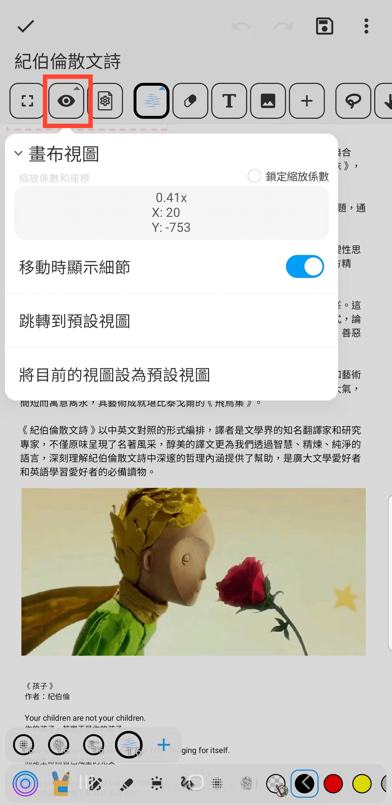

[使用說明](/dragonnest/drawnote/manual/zh) > [超級筆記](/dragonnest/drawnote/manual/zh/super_note) >

畫布視圖
---
畫布視圖是檢視和編輯筆記的界面，包含坐標和縮放信息。

- 為了便於瀏覽大頁面或內容豐富的頁面，您可以設置預設視圖。

- 點擊“跳轉到預設視圖”按鈕，即可迅速回到您設定的預設視圖位置。

#### 鎖定縮放係數
勾選“鎖定縮放係數”後，畫布將保持目前縮放級別，禁止手勢縮放。