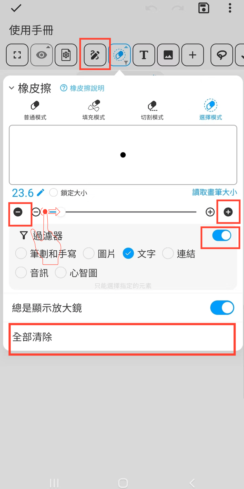

[使用說明](/dragonnest/drawnote/manual/zh-tw) > [超級筆記](/dragonnest/drawnote/manual/zh-tw/super_note) >

橡皮擦
---
橡皮擦功能針對各種使用場景提供了多個模式
#### 操作步驟

點擊工具列中的“橡皮擦”按鈕。

- 普通模式-採用遮罩技術，真實地模擬橡皮擦效果。可擦除各種元素，如線條、文本和圖片。此模式會生成擦除標記，允許用戶選擇已擦除的元素。

- 填充模式-與普通模式相似，但可以迅速擦除扇形區域。

- 切割模式-將元素切割成多個獨立部分，僅適用於線條和部分幾何圖形。此模式擦除後不留痕跡。

- 選擇模式-直接刪除選中的整體元素，並支援設置過濾條件。此模式擦除後無痕跡。

#### 提示
- 點擊“全部清除”可清空整個畫布。