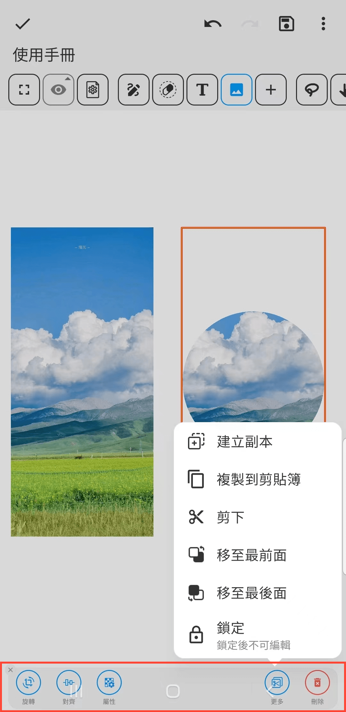

[使用手冊](/dragonnest/drawnote/manual/zh) > [超級筆記](/dragonnest/drawnote/manual/zh/super_note) >

插入圖片
---
#### 操作步驟

1.在工具列中點擊“圖片”按鈕。

2.通過點擊或滑動屏幕區域，即可在相應位置插入圖片。

#### 提示
- 選擇圖片後，底部工具列提供編輯選項，如旋轉、形狀和透明度。
- 您可結合文字功能，標註圖片內容，以實現更詳細和準確的表達。
- 點擊圖片可縮放大小。
- 

- 