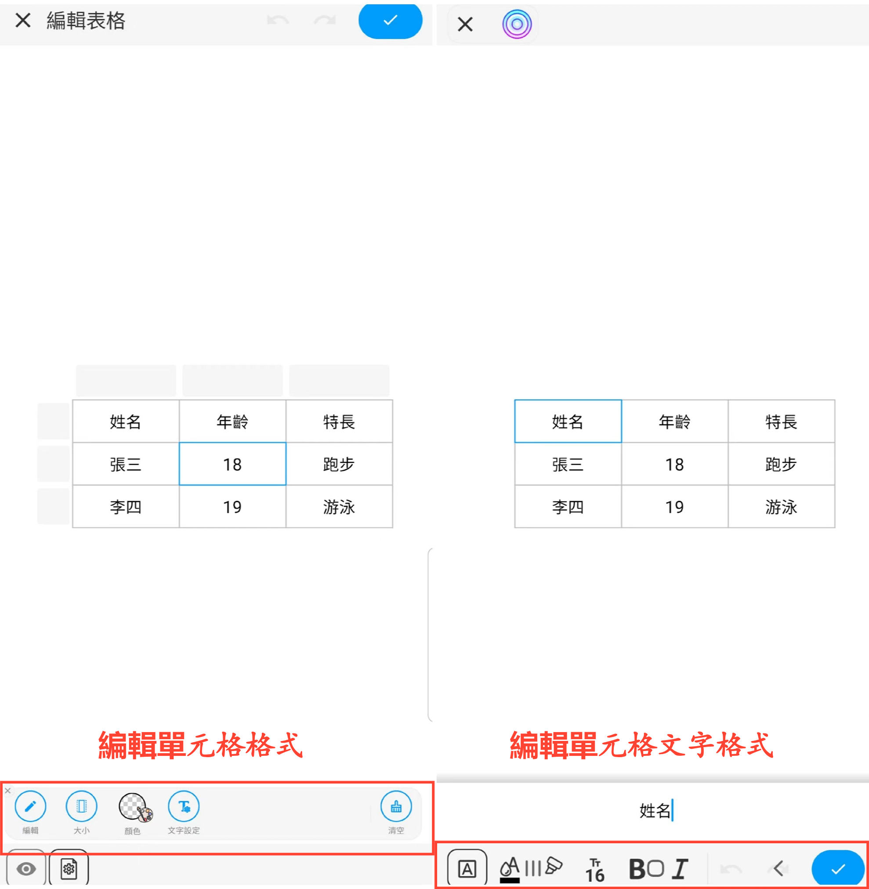
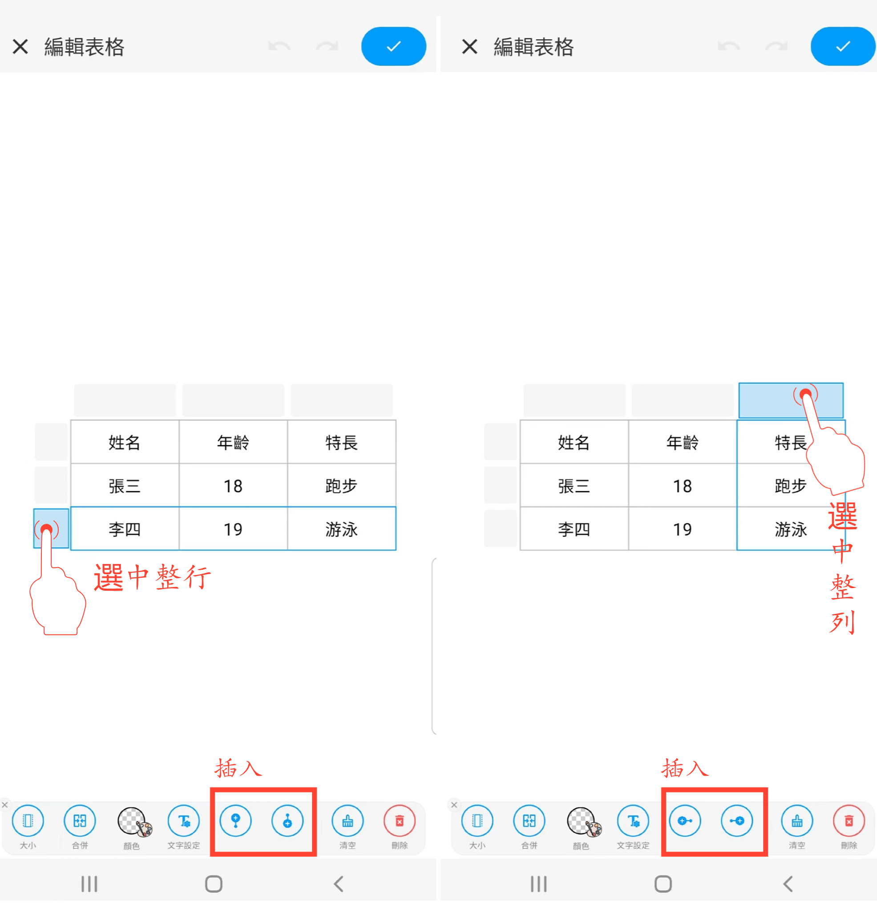
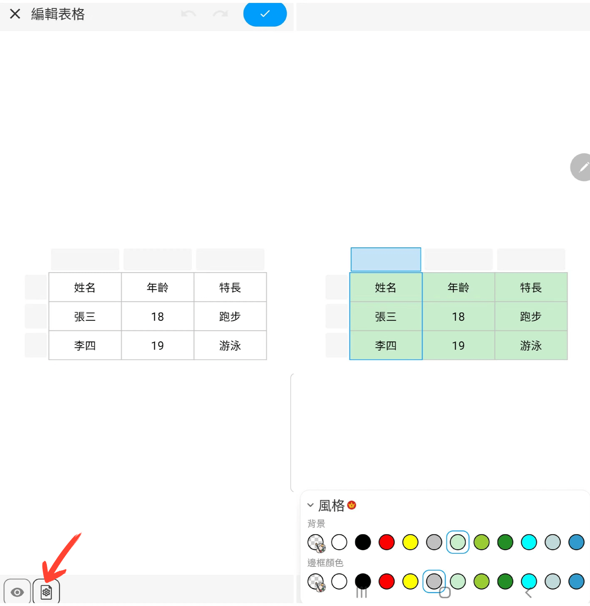
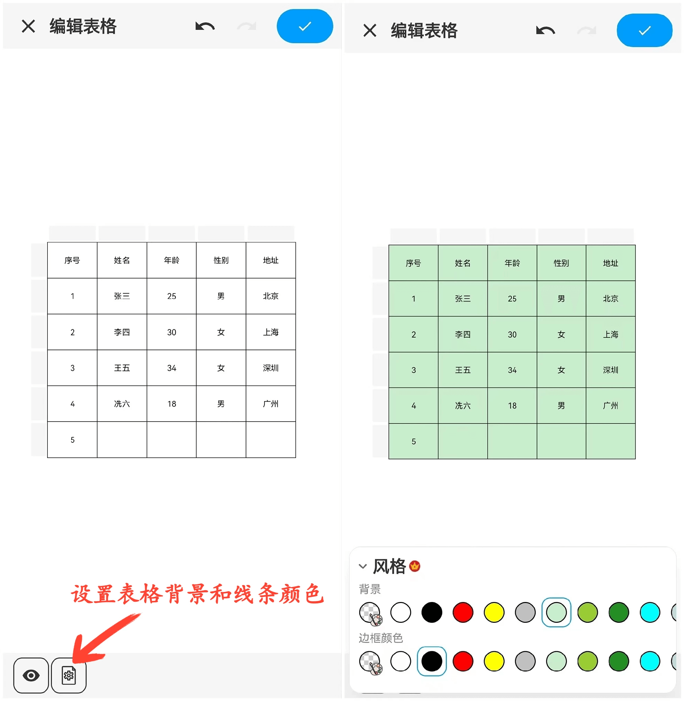

[使用手冊](/dragonnest/drawnote/manual/zh) > [超級筆記](/dragonnest/drawnote/manual/zh/super_note) >

插入表格
---
#### 操作步驟

1.在工具列中點擊“+”號按鈕。

2.選擇“插入表格”，即可將表格添加到您的筆記中。

#### 提示
- 設置單元格數量 - 滑動或輸入數字，選擇所需的單元格數量。

- 調整表格寬度和高度 - 滑動尺寸拉條或輸入數字，設置單元格的默認尺寸。

- 編輯單元格格式 - 選中單元格後，您可以設置其大小、顏色，還可以清空內容。

- 編輯單元格文字格式 - 選中單元格後，可編輯文字內容和格式，包括顏色、字號、加粗、下劃線和對齊方式。

- 設置整行或整列格式 - 選中行或列後，可對單元格進行合併、背景色設置、內容清空等操作。

- 插入整行或整列 - 選中行或列後，點擊“插入”按鈕，即可插入新的行或列。

- 設置表格外觀 - 點擊畫布左下角的“設置”按鈕，在菜單中，設置表格的背景色和邊框顏色。

