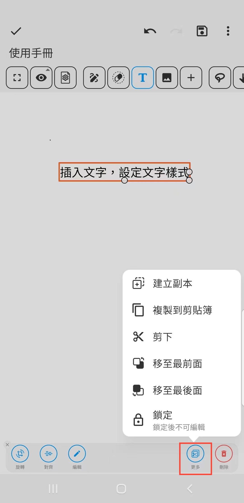
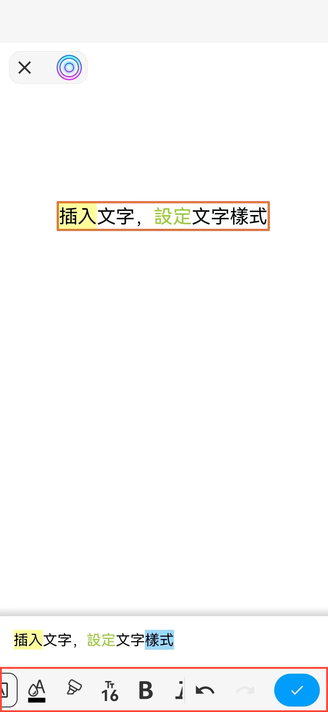

[使用手冊](/dragonnest/drawnote/manual/zh-tw) > [超級筆記](/dragonnest/drawnote/manual/zh-tw/super_note) >

插入文字
---
#### 操作步驟

1.在工具列中點擊“T”按鈕

2.點擊或滑動屏幕區域，即可在相應位置插入文本內容。

#### 提示
- 選中文本框後，可對其進行旋轉、對齊、編輯等操作，點擊“更多”還可進行副本創建、複製、剪切和鎖定等操作。

- 在文本編輯框中，選中文字後，可設置格式，包括顏色、大小、加粗、下劃線等。

