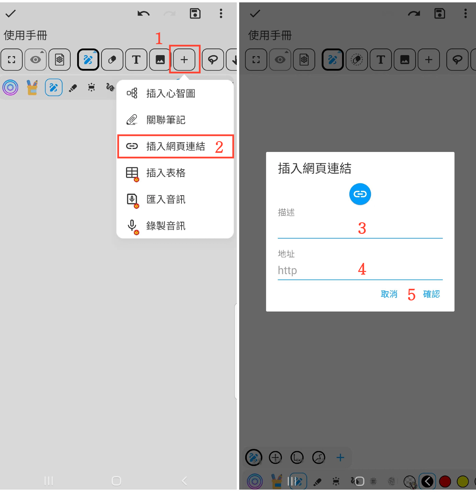

[使用手冊](/dragonnest/drawnote/manual/zh-tw) > [超級筆記](/dragonnest/drawnote/manual/zh/super_note) >

插入網頁連結
---
#### 操作步驟

1.在工具列中點擊“+”按鈕。

2.選擇“插入網頁連結”選項。

3.填寫連結名稱（可選）。

4.輸入或粘貼網頁連結。

5.確認操作後即可插入連結。

#### 提示
- 為連結取一個描述性名稱，方便後續查找和定位。

- 在閱讀模式下，點擊連結圖標即可直接訪問網頁。