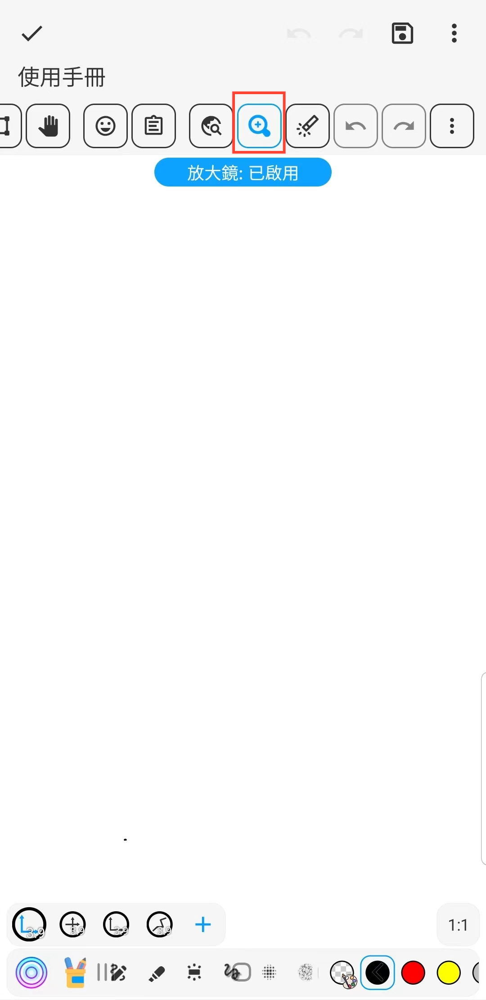

[使用手冊](/dragonnest/drawnote/manual/zh-tw) > [超級筆記](/dragonnest/drawnote/manual/zh-tw/super_note) >

放大鏡
---
放大鏡功能可以幫助您更方便地檢視和編輯筆記內容，特別是在處理小字型或精細圖形時。它能夠放大文字和圖片，並提供準確定位以及便捷操作。
#### 操作步驟

在超級筆記頁面，點選工具列的放大鏡按鈕，即可。

