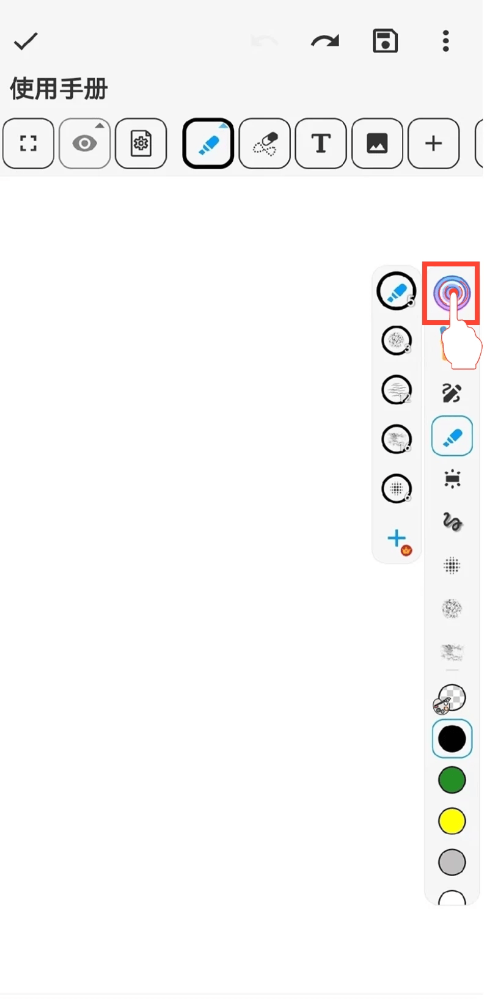

[使用手冊](/dragonnest/drawnote/manual/zh) > [超級筆記](/dragonnest/drawnote/manual/zh/super_note) >

移動筆盒工具列
---

您可以調整筆盒工具列在畫布上的橫向或縱向位置，輕松實現上下或左右移動。

#### 操作步驟

1.在筆盒頁面，選擇“工具列樣式”。

2.選擇橫向或縱向排列方式。

3.勾選確認。

#### 提示
- 按住筆盒工具列上的圓形按鈕，即可拖動筆盒工具列並調整其位置。

