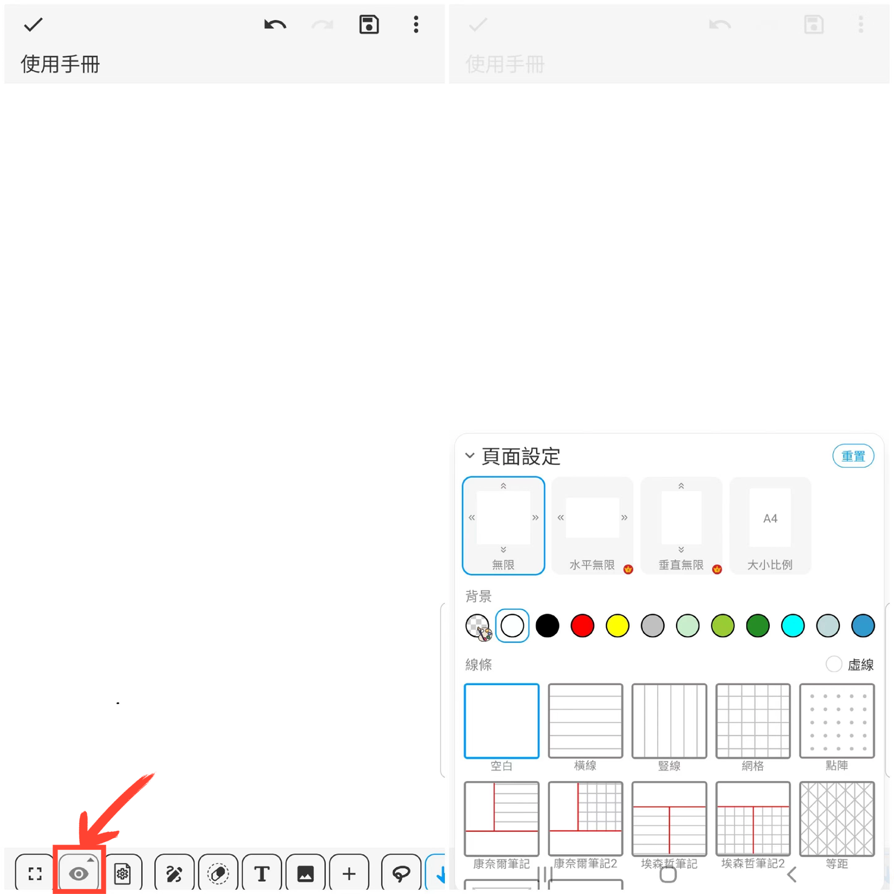

[使用手冊](/dragonnest/drawnote/manual/zh) > [超級筆記](/dragonnest/drawnote/manual/zh/super_note) >

頁面設置
---
您可以設置畫布的方向、尺寸、背景顏色以及筆記線條等。

#### 操作步驟

點擊工具列中的“頁面設置”按鈕。

#### 無限畫布

我們提供了無限、水平和垂直三種無限畫布方向，以滿足您不同的需求和偏好。

- 無限 - 橫向和縱向均無限伸展，縮放範圍為0.02x--200x。
- 水平無限 - 橫向無限伸展，縮放範圍為0.2x--1x。
- 垂直無限 - 縱向無限伸展，縮放範圍為0.2x--1x。

#### 畫布大小

點擊“大小比例”，可選擇A4、A3等尺寸，或者自定義您需要的尺寸。

#### 畫布背景和筆記線條

調整背景顏色，選擇適合的線條樣式，並可享有多樣的筆記模板，有助於更好地整理和記錄內容。